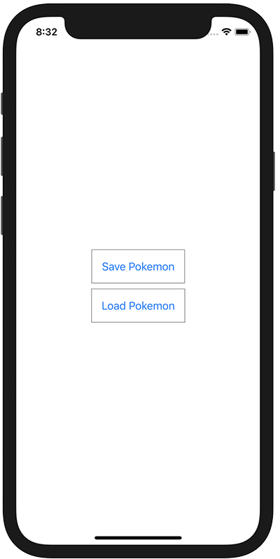

+++
title =  "自分で定義したStructをUserDefaultsに保存する"
url = "2021-07-03"
date = "2021-07-03"
description = "自分で定義したStructをUserDefaultsに保存する"
tags = [
  "SwiftUI"
]
categories = [
  "SwiftUI"
]
archives = "2021/07"
aliases = ["migrate-from-jekyl"]
+++

 

自分で定義したStructをUserDefaultsに保存する方法です。
そのままでは保存することができないので、一度 JSONEncoder で Data に保存してから保存します。

<!-- Amazon Ads -->


<!-- Google Ads -->



