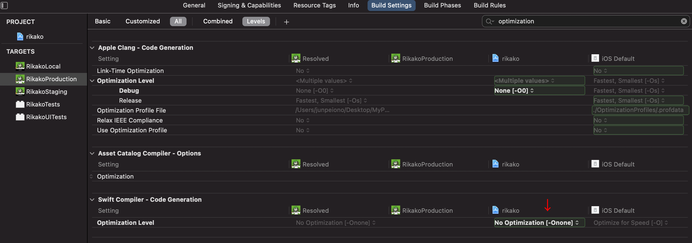

+++
title =  "iOSで実機ビルドだと動けどTestFlightから配信すると動かない"
url = "2021-07-05"
date = "2021-07-05"
description = "iOSで実機ビルドだと動けどTestFlightから配信すると動かない"
tags = [
  "SwiftUI"
]
categories = [
  "SwiftUI"
]
archives = "2021/07"
aliases = ["migrate-from-jekyl"]
+++

<br>

iOSアプリ開発中に実機ビルドだと動けどTestFlightから配信すると動かない。ということがありました。
以下の記事を参考にリリーズビルド時も最適化を無効化したら動くようになりました。

[App crashes in Release build but not in debug](https://stackoverflow.com/questions/25629841/app-crashes-in-release-build-but-not-in-debug)

Xcodegen を使っている場合は settings の base に以下を追加してあげます。

```
SWIFT_OPTIMIZATION_LEVEL: -Onone
```


<!-- Amazon Ads -->


<!-- Google Ads -->



