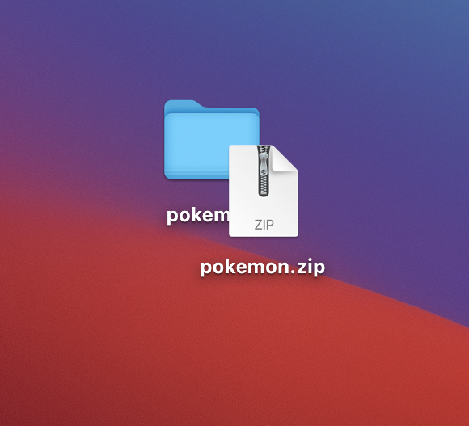

+++
title =  "MacOSでフォルダをzipに圧縮する"
url = "2021-09-03"
date = "2021-09-03"
description = "MacOSでフォルダをzipに圧縮する"
tags = [
  "Golang"
]
categories = [
  "Golang"
]
archives = "2021/09"
aliases = ["migrate-from-jekyl"]
+++

 

MacOSでフォルダをzipに圧縮する方法です。
zipにすることで LINE とかで送ることができるようになります。

<!-- Amazon Ads -->


<!-- Google Ads -->


フォルダを作り、その中にファイルを入れます。

フォルダを右クリックし、圧縮を選択します。

zipファイルが生成されます。

