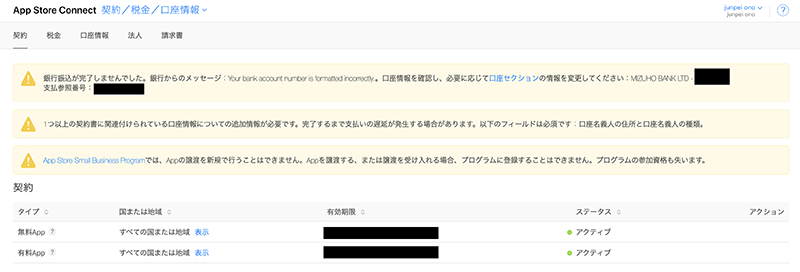

+++
title =  "AppStoreConnectで「銀行振り込みが完了しませんでした」というメッセージが現れて消えない"
url = "2021-09-04"
date = "2021-09-04"
description = "AppStoreConnectで「銀行振り込みが完了しませんでした」というメッセージが現れて消えない"
tags = [
  "Golang"
]
categories = [
  "Golang"
]
archives = "2021/09"
aliases = ["migrate-from-jekyl"]
+++

 

AppStoreConnectで「銀行振り込みが完了しませんでした」というメッセージが現れて消えない時の方法です。
契約／税金／口座情報 -> 口座情報 -> 銀行名をクリック -> 住所を入力で消すことができました。

<!-- Amazon Ads -->


<!-- Google Ads -->


