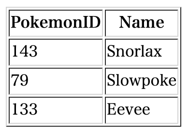

+++
title =  "Golangでtext/templateを使ってhtmlファイルを生成する"
url = "2021-10-02"
date = "2021-10-02"
description = "Golangでtext/templateを使ってhtmlファイルを生成する"
tags = [
  "Golang"
]
categories = [
  "Golang"
]
archives = "2021/10"
aliases = ["migrate-from-jekyl"]
+++

 

Golangでtext/templateを使ってhtmlファイルを生成する方法です。
Pokemon構造体の配列を作成し、一覧表示する htmlファイル（index.html）を作成しています。

<!-- Amazon Ads -->


<!-- Google Ads -->




