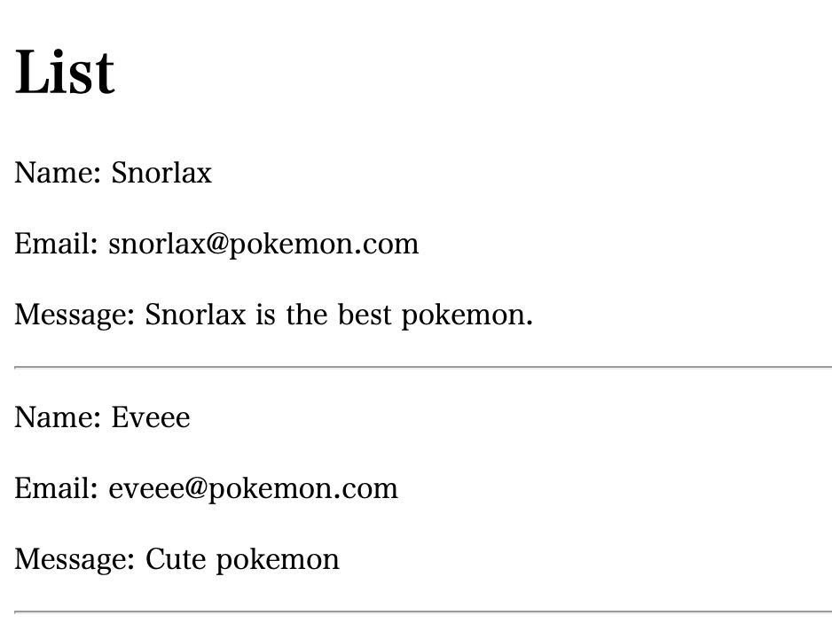

+++
title =  "Springを使ってお問い合わせフォームを作るその３"
url = "2021-10-06"
date = "2021-10-06"
description = "Springを使ってお問い合わせフォームを作るその３"
tags = [
  "Java",
  "Spring"
]
categories = [
  "Java",
  "Spring"
]
archives = "2021/10"
aliases = ["migrate-from-jekyl"]
+++

<br>

Springを使ってお問い合わせフォームを作るその３です。
今回は Spring と DB を接続して前回作成した `contact` テーブルの一覧を表示します。

`build.gradle` を開き `dependencied` に `org.springframework.boot:spring-boot-starter-data-jpa` と `mysql:mysql-connector-java:8.0.20` を追加します。

```
implementation 'org.springframework.boot:spring-boot-starter-data-jpa'
implementation 'mysql:mysql-connector-java:8.0.20'
```

`src/main/resources/application.properties` を開き、DBへの接続先情報を追加します。

```
spring.datasource.url=jdbc:mysql://127.0.0.1:3306/swiswiswift-db
spring.datasource.username=root
spring.datasource.password=password
spring.datasource.driverClassName=com.mysql.cj.jdbc.Driver
```

`list.html` を作成します。

```html
<!DOCTYPE HTML>
<html xmlns:th="https://www.thymeleaf.org">
<head>
    <title>Form List</title>
    <meta http-equiv="Content-Type" content="text/html; charset=UTF-8"/>
</head>
<body>
<h1>List</h1>
<div>
    <div th:each="contact : ${contacts}">
        <p th:text="'Name: ' + ${contact['name']}"></p>
        <p th:text="'Email: ' + ${contact['email']}"></p>
        <p th:text="'Message: ' + ${contact['message']}"></p>
        <hr>
    </div>
</div>
</body>
</html>
```

`MyController` にエンドポイントを追加します。`localhost:8080/form/list` にアクセスすると `contact` テーブルの一覧を取得して表示させます。

```java
@Controller
public class MyController {
    @Autowired
    JdbcTemplate jdbcTemplate;

    // ...略

    @GetMapping("/form/list")
    public String getFormList(Model model) {
        List<Map<String, Object>> contacts = jdbcTemplate.queryForList("select * from contact");
        model.addAttribute("contacts", contacts);
        return "list";
    }
}
```

`localhost:8080/form/list` にアクセスするとお問い合わせ内容一覧が表示されます。


