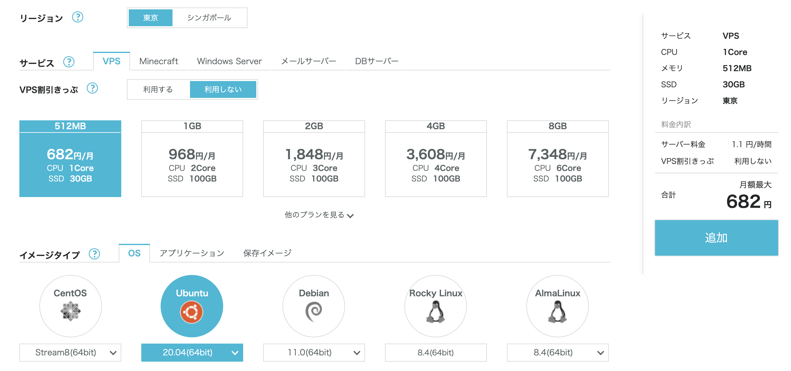
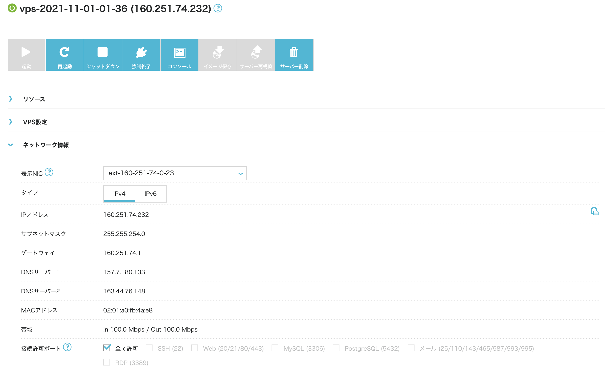

+++
title =  "Springを使ってお問い合わせフォームを作るその６"
url = "2021-10-09"
date = "2021-10-09"
description = "Springを使ってお問い合わせフォームを作るその６"
tags = [
  "Java",
  "Spring"
]
categories = [
  "Java",
  "Spring"
]
archives = "2021/10"
aliases = ["migrate-from-jekyl"]
+++

<br>

Springを使ってお問い合わせフォームを作るその６です。
今回は作ったアプリケーションをサーバーにデプロイしていきます。

[conoha](https://www.conoha.jp/) にログインし、サーバーを立てます。
OS は Ubuntu の20系で、一番小さい（安い）インスタンスを作成します。



サーバーが起動したらIPアドレスが表示されるのでそのIPアドレスをコピーします。
ここでは `160.251.74.232` がサーバーのIPアドレスです。
このIPアドレスはサーバーを起動する度に変わるので `160.251.74.232` ではなく表示された値を使用してください。



サーバーにログインします。

```bash
ssh root@160.251.101.154
```

初回接続時は以下の警告が出るので `yes` と入力します。

```
Are you sure you want to continue connecting (yes/no/[fingerprint])? 
```

パッケージの一覧、パッケージ本体の更新を行います。
何か聞かれたらとりあえず `Y` を入力します。

```bash
apt -y update
apt -y upgrade
```

Java11をインストールします。

```bash
apt -y install openjdk-11-jdk
```

11系が入ったことを確認します。

```bash
java --version
```

```
openjdk 11.0.11 2021-04-20
OpenJDK Runtime Environment (build 11.0.11+9-Ubuntu-0ubuntu2.20.04)
OpenJDK 64-Bit Server VM (build 11.0.11+9-Ubuntu-0ubuntu2.20.04, mixed mode, sharing)
```

MySQLをインストールします。

```bash
apt -y install mysql-server
```

MySQLが入ったことを確認します。

```bash
mysql --version
```

```
mysql  Ver 8.0.27-0ubuntu0.20.04.1 for Linux on x86_64 ((Ubuntu))
```

以下のコマンドで MySQL の初期設定を行います。
読みながら進めてください、基本は `Y` で大丈夫です。
ここで root ユーザーのパスワードを設定します。

```bash
mysql_secure_installation
```

MySQLサーバーにログインして、アプリケーション用のテーブルなどを作っていきます。

```bash
mysql -u root -p
```

DB名に `-` があるとバッククオートで囲む必要があるみたいです。

```sql
create database `swiswiswift-db`;
use swiswiswift-db;
```

```sql
create table contact(
    name varchar(255) not null,
    email varchar(255) not null,
    message varchar(1023) not null
);
```

アプリケーション用のDBユーザー、`spring` を作ります。
`sdfYsdfsdfijhsdf&*8sd&` はパスワードです。

```sql
CREATE USER 'spring'@'127.0.0.1' IDENTIFIED BY 'sdfYsdfsdfijhsdf&*8sd&';
GRANT ALL PRIVILEGES ON *.* TO 'spring'@'127.0.0.1' WITH GRANT OPTION;
FLUSH PRIVILEGES;


CREATE USER 'spring'@'localhost' IDENTIFIED BY 'sdfYsdfsdfijhsdf&*8sd&';
GRANT ALL PRIVILEGES ON *.* TO 'spring'@'localhost' WITH GRANT OPTION;
FLUSH PRIVILEGES;
```

一度 MySQL からログアウトし、`spring` ユーザーでログインできることを確認します。

```bash
mysql -u spring -h 127.0.0.1 -p
```

インストールした MySQL のバージョンが `8.0.27` で新しいので、アプリケーションの `build.gradle` の `mysql-connector-java` のバージョンを更新します。

```
implementation 'mysql:mysql-connector-java:8.0.27'
```

再度ビルドし、`.jar` を作成します。

```bash
 ./gradlew build 
```

作成した `.jar` ファイルをサーバーに転送します。

```Bash
scp spring-0.0.1-SNAPSHOT.jar root@160.251.101.154:/opt
```

転送後再度サーバーにログインします。

```bash
ssh root@160.251.101.154
```

`/opt` ディレクトリに移動し、アプリケーションを起動します。文字列に特殊文字（`&`とか）が含まれると別のコマンドと認識されてしまうので、シングルクオートで囲ってあげます。

```bash
java -Xms128M -Xmx128M -jar spring-0.0.1-SNAPSHOT.jar \
  --server.port=80 \
  --spring.datasource.url=jdbc:mysql://127.0.0.1:3306/swiswiswift-db \
  --spring.datasource.username=spring \
  --spring.datasource.password='sdfYsdfsdfijhsdf&*8sd&'
```

ブラウザで `160.251.101.154` にアクセスすると作成したアプリケーションが表示されているはずです。
`control + z` でサスペンドし、`jobs` コマンドでプロセスIDを確認し、`bg` コマンドでバックグラウンドで動かすこともできます。
