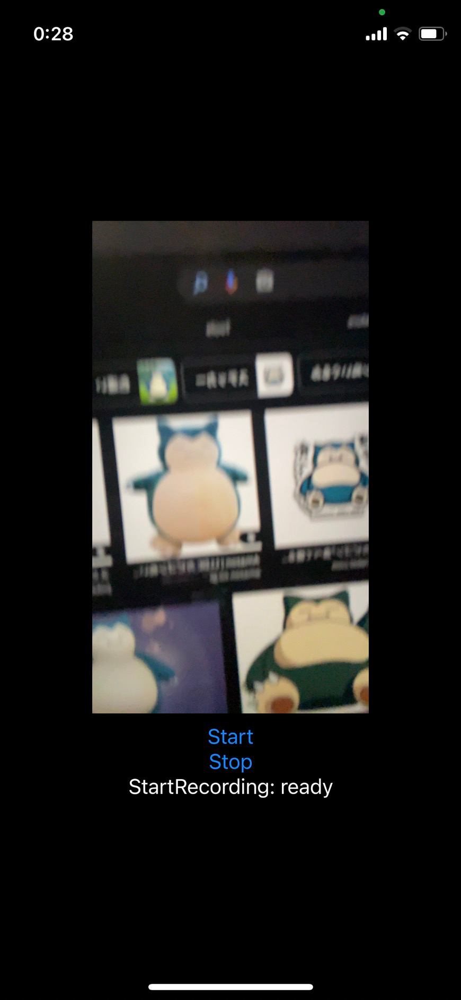

+++
title =  "SwiftUIでカメラを使う"
url = "2021-11-01"
date = "2021-11-01"
description = "SwiftUIでカメラを使う"
tags = [
  "iOS",
  "SwiftUI"
]
categories = [
  "iOS",
  "SwiftUI"
]
archives = "2021/11"
aliases = ["migrate-from-jekyl"]
+++

 

SwiftUIでカメラを使う方法です。
録画を可能にする `CameraView` を作成しそれを SwiftUI 側で呼び出すようにします。
SwiftUIでカメラを使ったり、写真を保存するには色々とプライバシーの許可を `Info.plist` に設定する必要があります。

[Swift] AVFoundation による動画撮影の設定: カメラ種類 / ズーム / 録画時間 / 画質](https://superhahnah.com/swift-avcapture-settings/)

<!-- Amazon Ads -->


<!-- Google Ads -->



