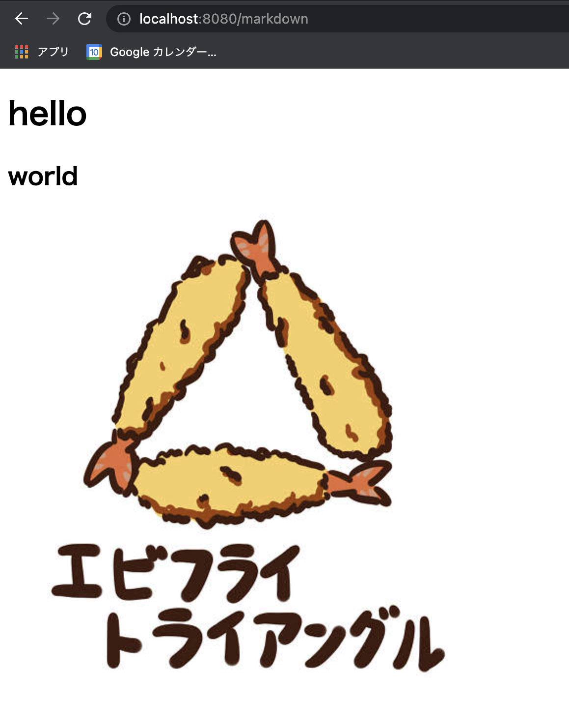

+++
title =  "SpringBootでマークダウンをHTMLに変換してThymeleafで表示する"
url = "2021-11-03"
date = "2021-11-03"
description = "SpringBootでマークダウンをHTMLに変換してThymeleafで表示する"
tags = [
  "Java",
  "Spring"
]
categories = [
  "Java",
  "Spring"
]
archives = "2021/11"
aliases = ["migrate-from-jekyl"]
+++

<br>

SpringBootでマークダウンをHTMLに変換してThymeleafで表示する方法です。
マークダウンをHTMLに変換するライブラリとして [flexmark-java](https://github.com/vsch/flexmark-java)を使用しました。

`build.gradle` の `dependencies` に `flexmark-java` を追加します。

```gradle
implementation 'com.vladsch.flexmark:flexmark-all:0.62.2'
```

`markdown.html` を作成し、Templateフォルダに追加します。

```html
<!DOCTYPE html>
<html lang="en">
<head>
    <meta charset="UTF-8">
    <title>Markdown</title>
</head>
<body>
[(${html})]
</body>
</html>
```

`/markdown` エンドポイントを追加します。
`markdown` 変数を変換し、 `html` 変数に入れています。

```java
@GetMapping("/markdown")
public String getMarkdown(Model model) {
    // create parser and renderer instance
    Parser parser = Parser.builder().build();
    HtmlRenderer renderer = HtmlRenderer.builder().build()
    String markdown = "# hello\n## world\n"
    // convert to markdown to html
    Node document = parser.parse(markdown);
    String html = renderer.render(document)
    model.addAttribute("html", html);
    return "markdown";
}
```

画面にアクセスすると以下のような画面が表示されます。



`# 文字列` は `<h1>文字列</h1>` に、`## 文字列` は `<h2>文字列</h2>` に変換されていることがわかります。

```html
<!DOCTYPE html>
<html lang="en">
<head>
    <meta charset="UTF-8">
    <title>Markdown</title>
</head>
<body>
<h1>hello</h1>
<h2>world</h2>
<p></p>

</body>
</html>
```


