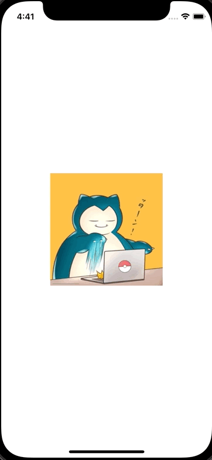

+++
title =  "UIKitのScrollViewでページングを実装する"
url = "2021-11-04"
date = "2021-11-04"
description = "UIKitのScrollViewでページングを実装する"
tags = [
  "iOS",
  "UIKit"
]
categories = [
  "iOS",
  "UIKit"
]
archives = "2021/11"
aliases = ["migrate-from-jekyl"]
+++

 

UIKitのScrollViewでページングを実装する方法です。
スクロールすると切り替わるタイミングでピタッと止まります。

<!-- Amazon Ads -->


<!-- Google Ads -->



