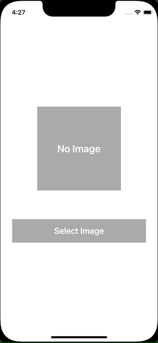

+++
title =  "SwiftUIでPHPickerViewControllerを使って画像を選択する"
url = "2021-11-09"
date = "2021-11-09"
description = "SwiftUIでPHPickerViewControllerを使って画像を選択する"
tags = [
  "Swift",
  "SwiftUI"
]
categories = [
  "Swift",
  "SwiftUI"
]
archives = "2021/11"
aliases = ["migrate-from-jekyl"]
+++

 

SwiftUIでPHPickerViewControllerを使って画像を選択する方法です。
ImagePickerというクラスを使って実現しました。

<!-- Amazon Ads -->


<!-- Google Ads -->




