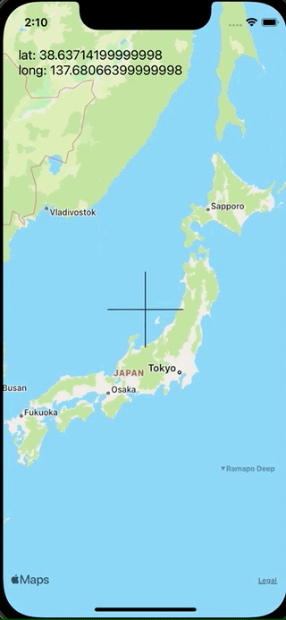

+++
title =  "SwiftでMapViewの中央に十字を用意し、その中央の座標を取得する"
url = "2021-11-12"
date = "2021-11-12"
description = "SwiftでMapViewの中央に十字を用意し、その中央の座標を取得する"
tags = [
  "iOS",
  "UIKit"
]
categories = [
  "iOS",
  "UIKit"
]
archives = "2021/11"
aliases = ["migrate-from-jekyl"]
+++

 

SwiftでMapViewの中央に十字を用意し、その中央の座標を取得する方法です。
スクロールしたりピンチしたタイミングで `regionDidChangeAnimated` が呼ばれるので、その時の中心の座標を取得しています。

<!-- Amazon Ads -->


<!-- Google Ads -->



