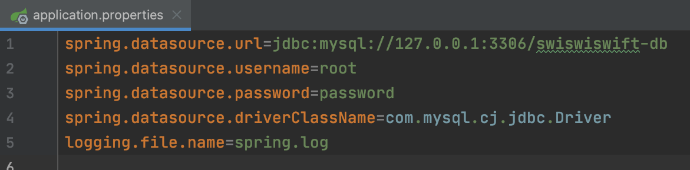

+++
title =  "SpringBootでログをファイルに出力する"
url = "2021-11-13"
date = "2021-11-13"
description = "SpringBootでログをファイルに出力する"
tags = [
  "Java",
  "Spring"
]
categories = [
  "Java",
  "Spring"
]
archives = "2021/11"
aliases = ["migrate-from-jekyl"]
+++

<br>

SpringBootでログをファイルに出力する方法です。
`application.properties` に `logging.file.name=spring.log` を追加するとログがファイルとしても出力されます。



ローカルではコンソールにログを出す、サーバーではコンソールとファイルにログを出したい場合は実行時にプロパティを渡すことで実現できます。

```
java spring.jar --server.port=80 --logging.file.name=spring.log
```

[参考](https://spring.pleiades.io/spring-boot/docs/current/reference/html/features.html#features.logging)

