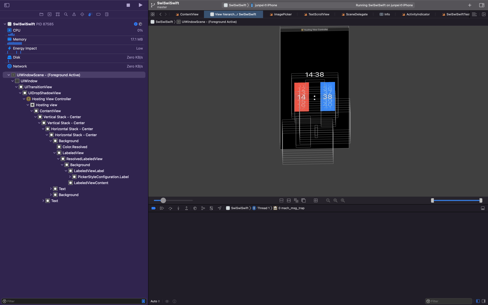
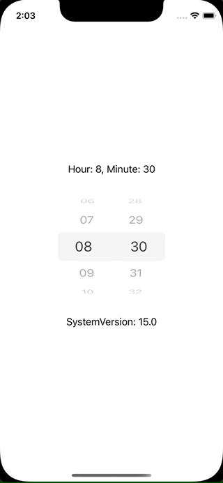

+++
title =  "iOS15でPickerを横に並べるとタップ領域が重なってしまう"
url = "2022-01-02"
date = "2022-01-02"
description = "iOS15でPickerを横に並べるとタップ領域が重なってしまう"
tags = [
  "SwiftUI",
  "Swift"
]
categories = [
  "SwiftUI",
  "Swift"
]
archives = "2022/01"
aliases = ["migrate-from-jekyl"]
+++

 

iOS15でPickerを横に並べるとタップ領域が重なってしまう不具合に悩まされたのでその忘備録です。

以下の様なコードをiOS15の実機で実行し、左側の行を動かそうとすると右側の行が動いてしまいます。iOS14やシミュレーターでは問題なく動作します。

[Pickerを複数並べると.clip()を使ってもタップ領域が広がってしまうって問題です！](https://twitter.com/takoikatakotako/status/1478953308308271110)



View Hierarchyを見たところ、タップ領域がclipされていないことが原因かと思われます。

Apple Developer Technical Support に助けを求めたところ「現時点では回避策がない既知の問題です。」と言われたので `UIViewRepresentable` を使って自分で作るしかなさそうです。


