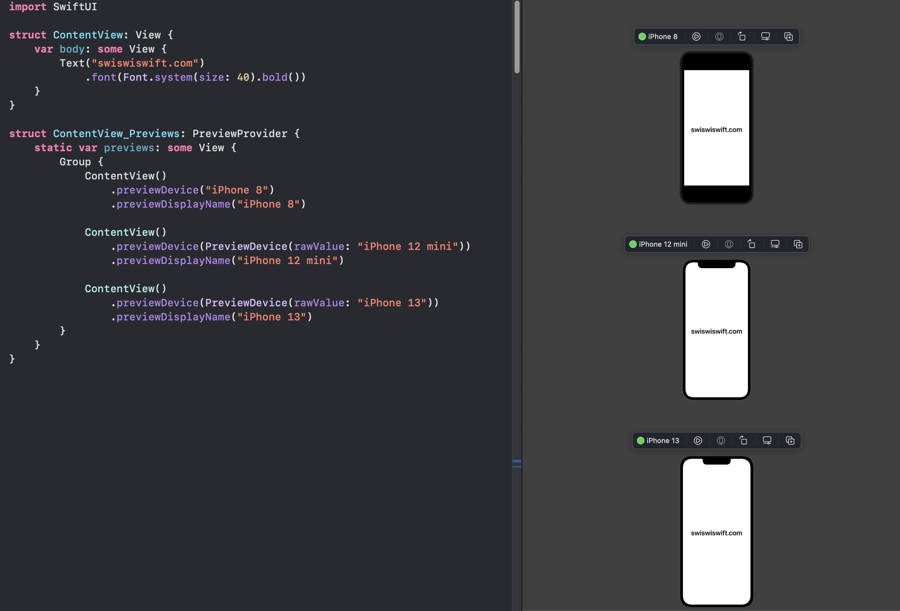

+++
title =  "SwiftUIでさまざまなデバイスのプレビューを確認する"
url = "2022-01-03"
date = "2022-01-03"
description = "SwiftUIでさまざまなデバイスのプレビューを確認する"
tags = [
  "SwiftUI",
  "Swift"
]
categories = [
  "SwiftUI",
  "Swift"
]
archives = "2022/01"
aliases = ["migrate-from-jekyl"]
+++

<br>

SwiftUIでさまざまなデバイスのプレビューを確認する方法です。

まず以下のコマンドでデバイスの一覧を確認します。
デバイス名は正確に入力する必要があります。

```bash
$ xcrun simctl list devicetypes
```

```
== Device Types ==
iPhone 4s (com.apple.CoreSimulator.SimDeviceType.iPhone-4s)
iPhone 5 (com.apple.CoreSimulator.SimDeviceType.iPhone-5)
iPhone 5s (com.apple.CoreSimulator.SimDeviceType.iPhone-5s)
iPhone 6 Plus (com.apple.CoreSimulator.SimDeviceType.iPhone-6-Plus)
iPhone 6 (com.apple.CoreSimulator.SimDeviceType.iPhone-6)
iPhone 6s (com.apple.CoreSimulator.SimDeviceType.iPhone-6s)
iPhone 6s Plus (com.apple.CoreSimulator.SimDeviceType.iPhone-6s-Plus)
iPhone SE (1st generation) (com.apple.CoreSimulator.SimDeviceType.iPhone-SE)
iPhone 7 (com.apple.CoreSimulator.SimDeviceType.iPhone-7)
iPhone 7 Plus (com.apple.CoreSimulator.SimDeviceType.iPhone-7-Plus)
iPhone 8 (com.apple.CoreSimulator.SimDeviceType.iPhone-8)
iPhone 8 Plus (com.apple.CoreSimulator.SimDeviceType.iPhone-8-Plus)
iPhone X (com.apple.CoreSimulator.SimDeviceType.iPhone-X)
iPhone Xs (com.apple.CoreSimulator.SimDeviceType.iPhone-XS)
iPhone Xs Max (com.apple.CoreSimulator.SimDeviceType.iPhone-XS-Max)
iPhone Xʀ (com.apple.CoreSimulator.SimDeviceType.iPhone-XR)
iPhone 11 (com.apple.CoreSimulator.SimDeviceType.iPhone-11)
iPhone 11 Pro (com.apple.CoreSimulator.SimDeviceType.iPhone-11-Pro)
iPhone 11 Pro Max (com.apple.CoreSimulator.SimDeviceType.iPhone-11-Pro-Max)
iPhone SE (2nd generation) (com.apple.CoreSimulator.SimDeviceType.iPhone-SE--2nd-generation-)
iPhone 12 mini (com.apple.CoreSimulator.SimDeviceType.iPhone-12-mini)
iPhone 12 (com.apple.CoreSimulator.SimDeviceType.iPhone-12)
iPhone 12 Pro (com.apple.CoreSimulator.SimDeviceType.iPhone-12-Pro)
iPhone 12 Pro Max (com.apple.CoreSimulator.SimDeviceType.iPhone-12-Pro-Max)
iPhone 13 Pro (com.apple.CoreSimulator.SimDeviceType.iPhone-13-Pro)
iPhone 13 Pro Max (com.apple.CoreSimulator.SimDeviceType.iPhone-13-Pro-Max)
iPhone 13 mini (com.apple.CoreSimulator.SimDeviceType.iPhone-13-mini)
iPhone 13 (com.apple.CoreSimulator.SimDeviceType.iPhone-13)
...
```

参考: [previewDevice(_:)](https://developer.apple.com/documentation/swiftui/path/previewdevice(_:))



<!-- Amazon Ads -->


<!-- Google Ads -->



