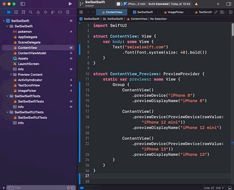

+++
title =  "Xcodeで左側のファイル一覧のナビゲーションが隠れてしまって出てこない"
url = "2022-01-04"
date = "2022-01-04"
description = "Xcodeで左側のファイル一覧のナビゲーションが隠れてしまって出てこない"
tags = [
  "Xcode",
  "Swift"
]
categories = [
  "Xcode",
  "Swift"
]
archives = "2022/01"
aliases = ["migrate-from-jekyl"]
+++

 

Xcodeで左側のファイル一覧のナビゲーションが隠れてしまって出てこないときの方法です。
`command` + `0` で出したり引っ込めたりすることができます。

<!-- Amazon Ads -->


<!-- Google Ads -->


