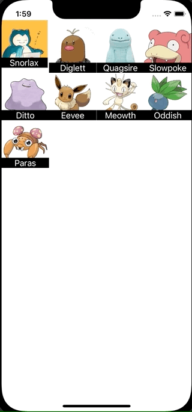

+++
title =  "UICollectionViewのセルを並び替える"
url = "2022-01-05"
date = "2022-01-05"
description = "UICollectionViewのセルを並び替える"
tags = [
  "Xcode",
  "Swift"
]
categories = [
  "Xcode",
  "Swift"
]
archives = "2022/01"
aliases = ["migrate-from-jekyl"]
+++

 

UICollectionViewのセルを並び替える方法です。
長押しすると移動できるようになります。

参考: [CollectionViewの並び替えを実装する | RE:ENGINES](https://re-engines.com/2019/11/14/collectionview%E3%81%AE%E4%B8%A6%E3%81%B3%E6%9B%BF%E3%81%88%E3%82%92%E5%AE%9F%E8%A3%85%E3%81%99%E3%82%8B/)

<!-- Amazon Ads -->


<!-- Google Ads -->




