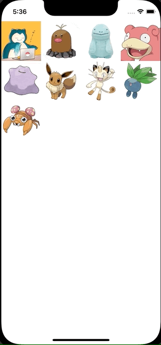

+++
title =  "CollectionViewで並び替え時に選択されたセルにアニメーションを付与する"
url = "2022-01-06"
date = "2022-01-06"
description = "CollectionViewで並び替え時に選択されたセルにアニメーションを付与する"
tags = [
  "Xcode",
  "Swift"
]
categories = [
  "Xcode",
  "Swift"
]
archives = "2022/01"
aliases = ["migrate-from-jekyl"]
+++

 

CollectionViewで並び替え時に選択されたセルにアニメーションを付与する方法です。
長押しすると移動できるようになります。

参考: [iOS – Longpress drag and drop using UICollectionView with Animation](https://mobikul.com/ios-longpress-drag-and-drop-using-uicollectionview-with-animation/)

<!-- Amazon Ads -->


<!-- Google Ads -->



