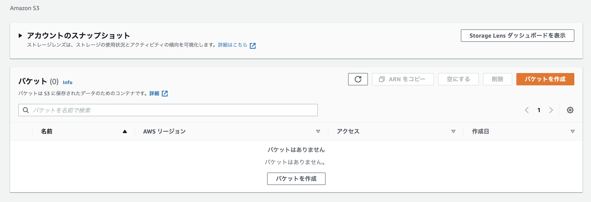
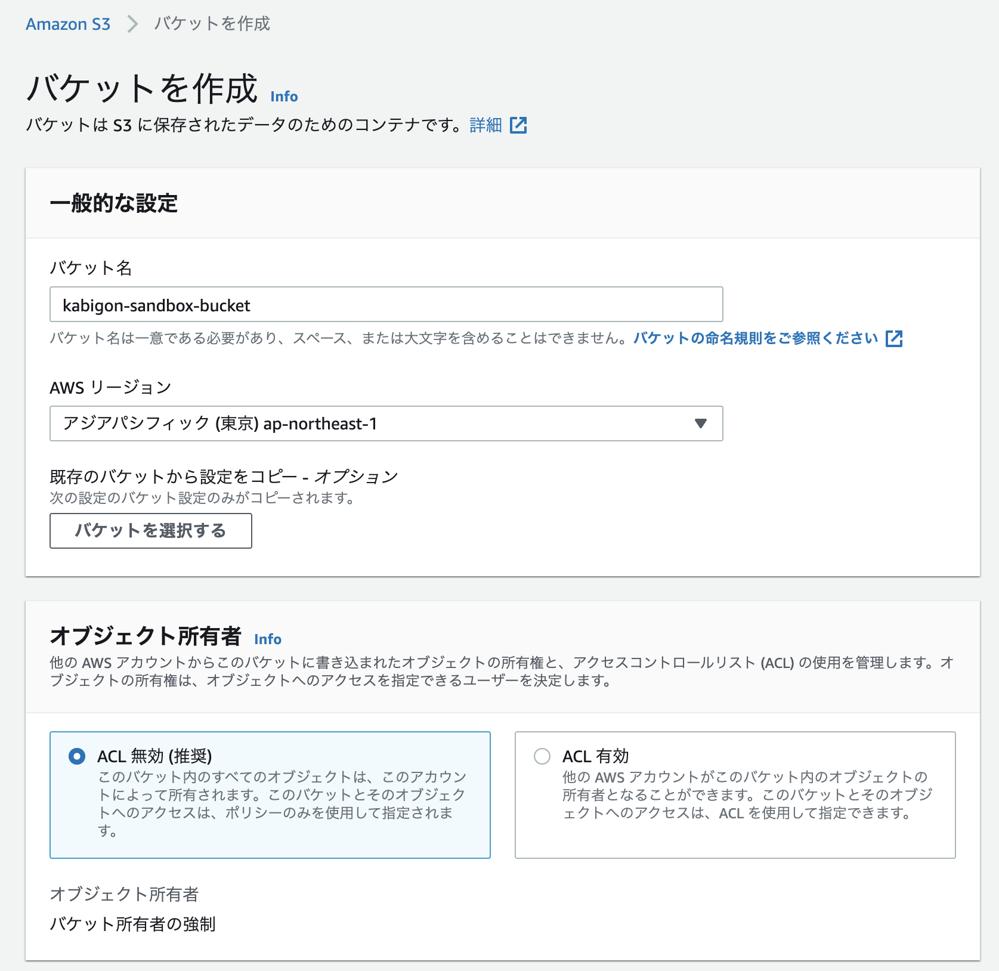
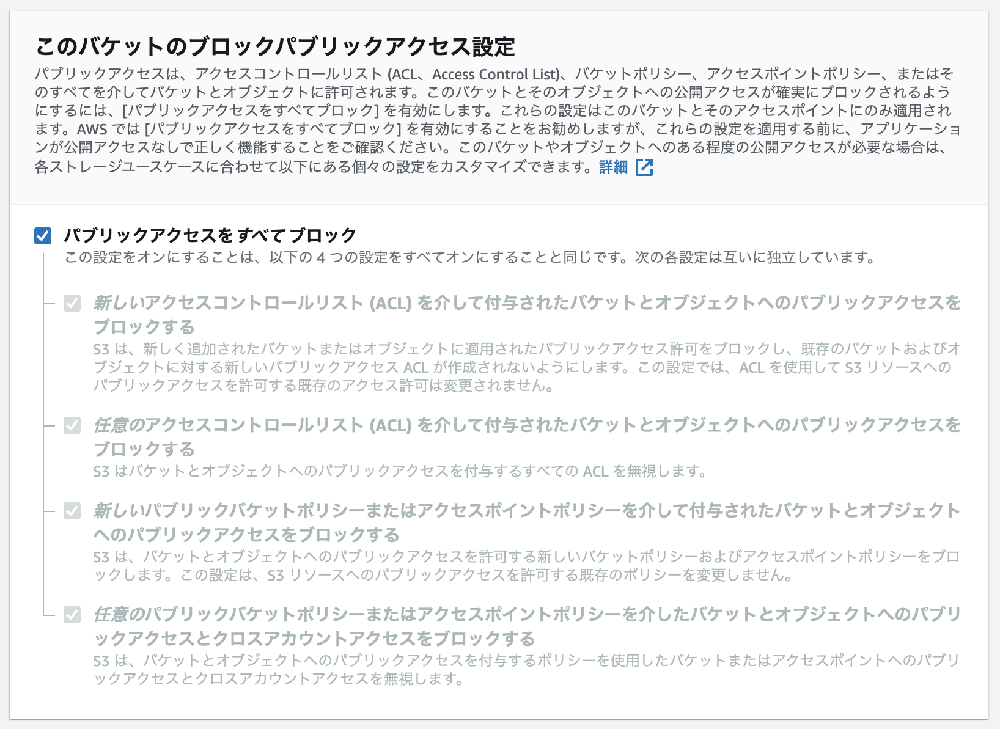
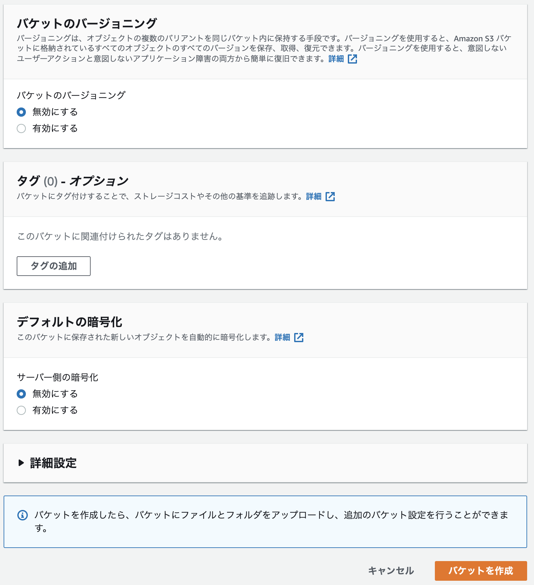
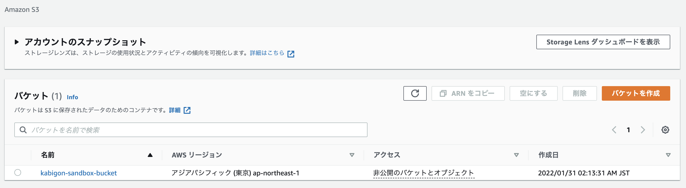
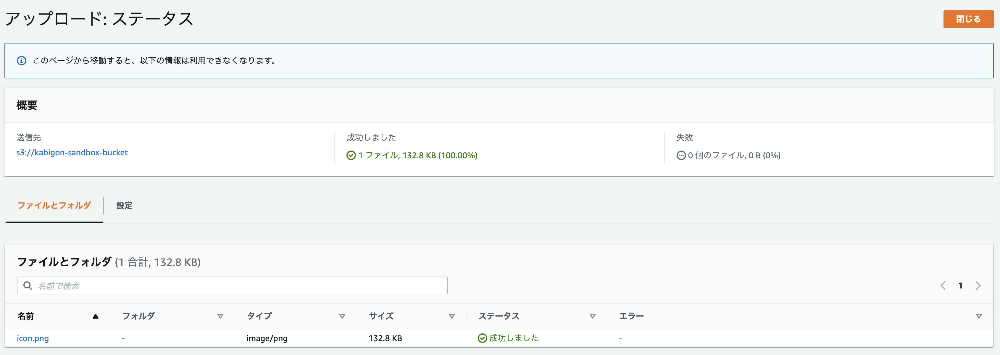
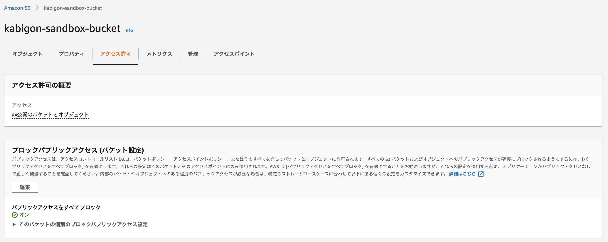
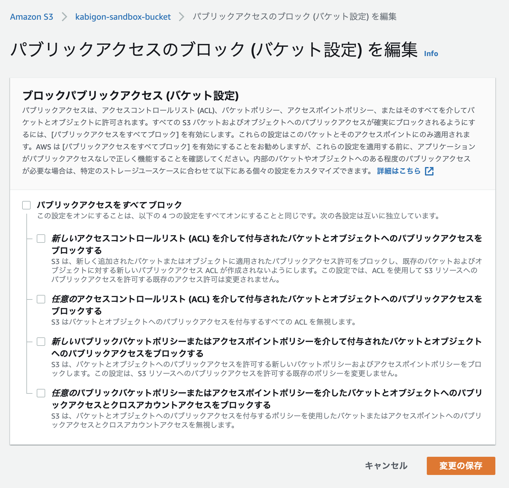
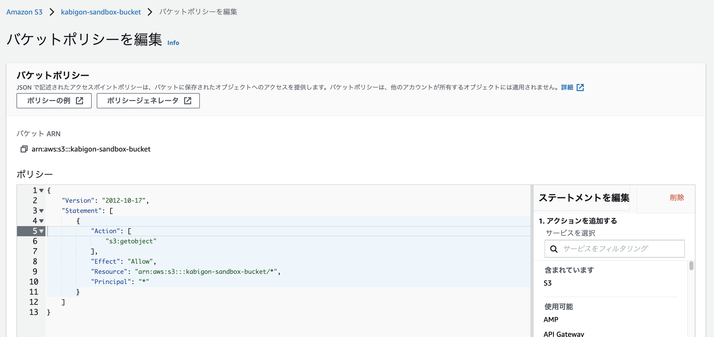
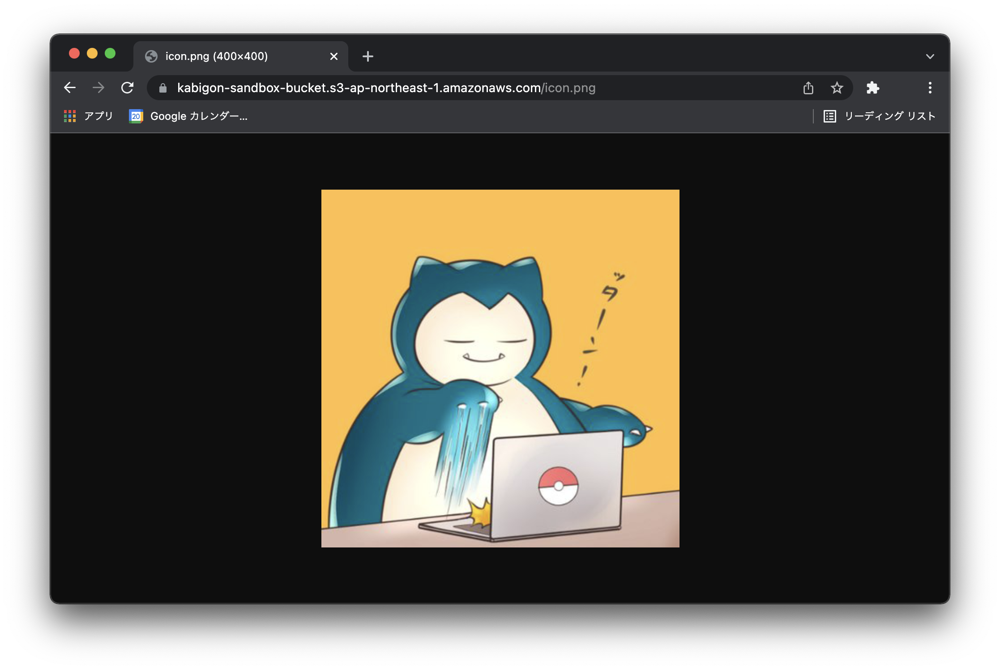

+++
title =  "S3に静的ファイルを置いてインターネットに公開する"
url = "2022-01-07"
date = "2022-01-07"
description = "S3に静的ファイルを置いてインターネットに公開する"
tags = [
  "AWS"
]
categories = [
  "AWS"
]
archives = "2022/01"
aliases = ["migrate-from-jekyl"]
+++

<br>

S3に画像などの静的ファイルを置いて公開する方法です。
まずS3のコンソールにアクセスします。



「バケットを作成」ボタンから新しいバケットを作成します。
今回は `kabigon-sandbox-bucket` という名前で作成します。
バケット名はグローバルで一意でなければなりません。



ブロックパブリックアクセスの設定は後で変更しますが有効にします。



以下の設定でバケットを作成します。



バケットが作成されたことを一覧から確認できます。



バケットに静的ファイルを入れてみましょう。
今回は `icon.png` という画像をアップロードします。



今回はバケットの中のファイルを公開するので、ブロックパブリックアクセスの設定をオフにする必要があります。
バケット名を選択し、「アクセス許可」のタブを選択します。



ブロックパブリックアクセスの設定をオフにします。



バケットポリシーを編集します。
バケットポリシーを設定することでリソースへのアクセスを管理することができます。
以下の設定は `kabigon-sandbox-bucket` のオブジェクトを無制限に取得できることを意味しています。



```
{
    "Version": "2012-10-17",
    "Statement": [
        {
            "Effect": "Allow",
            "Principal": "*",
            "Action": "s3:getobject",
            "Resource": "arn:aws:s3:::kabigon-sandbox-bucket/*"
        }
    ]
}
```

これで AWS 側の設定は完了です。
以下の URL にアクセスすると画像が表示されることを確認できます。

https://kabigon-sandbox-bucket.s3-ap-northeast-1.amazonaws.com/icon.png



