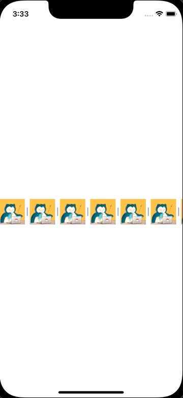

+++
title =  "CollectionViewに区切り線を追加する"
url = "2022-02-04"
date = "2022-02-04"
description = "CollectionViewに区切り線を追加する"
tags = [
  "iOS",
  "Swift"
]
categories = [
  "iOS",
  "Swift"
]
archives = "2022/02"
aliases = ["migrate-from-jekyl"]
+++

 

CollectionViewに区切り線を追加する方法です。

参考:

[UICollectionView の Layout で悩んだら](https://techlife.cookpad.com/entry/2017/06/29/190000)

[Decoration Viewを用いてCollection Viewに区切り線と背景を追加する](https://qiita.com/imk2o/items/fa1f4cc0b4bbe4244226)

<!-- Amazon Ads -->


<!-- Google Ads -->




