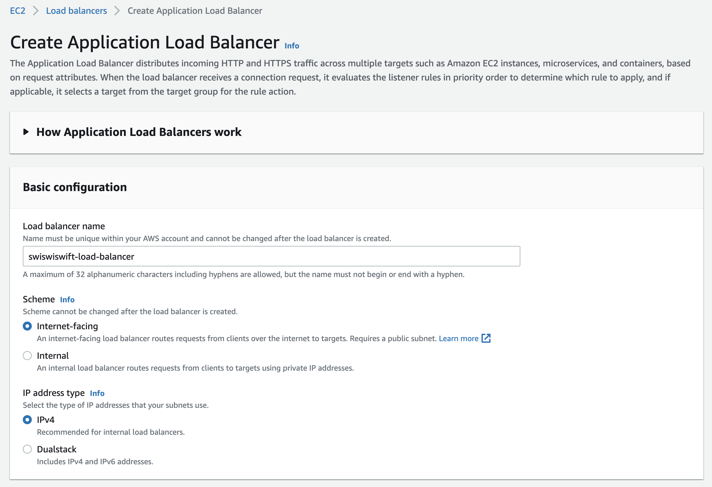
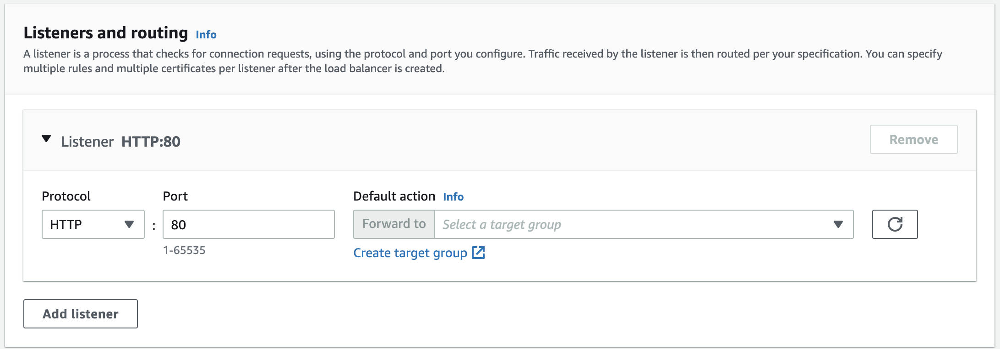
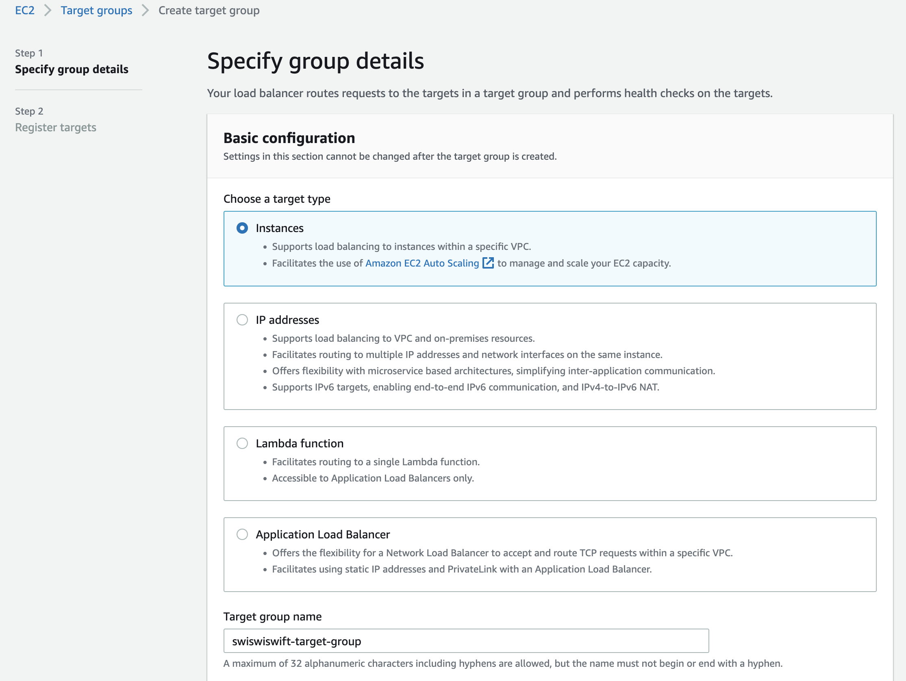
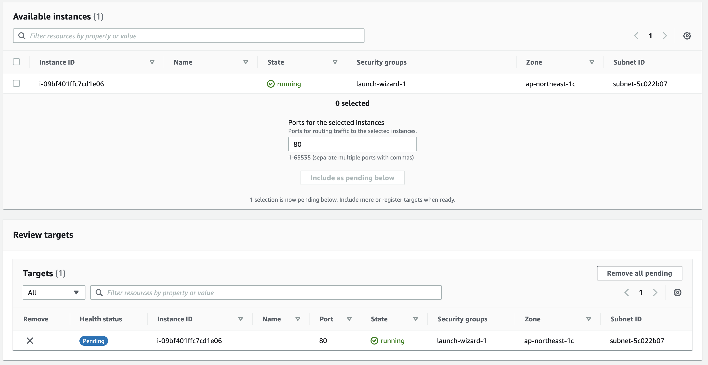
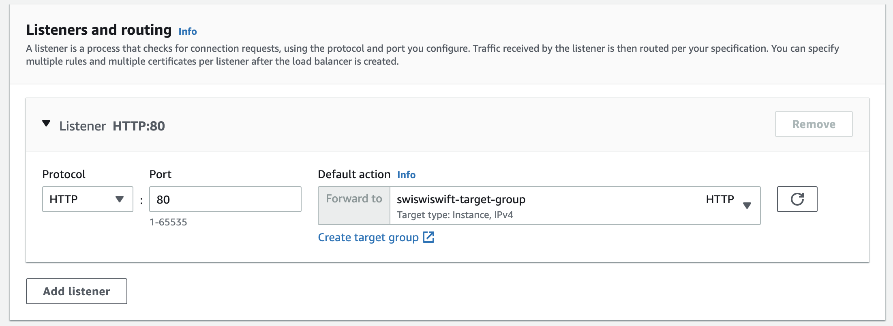
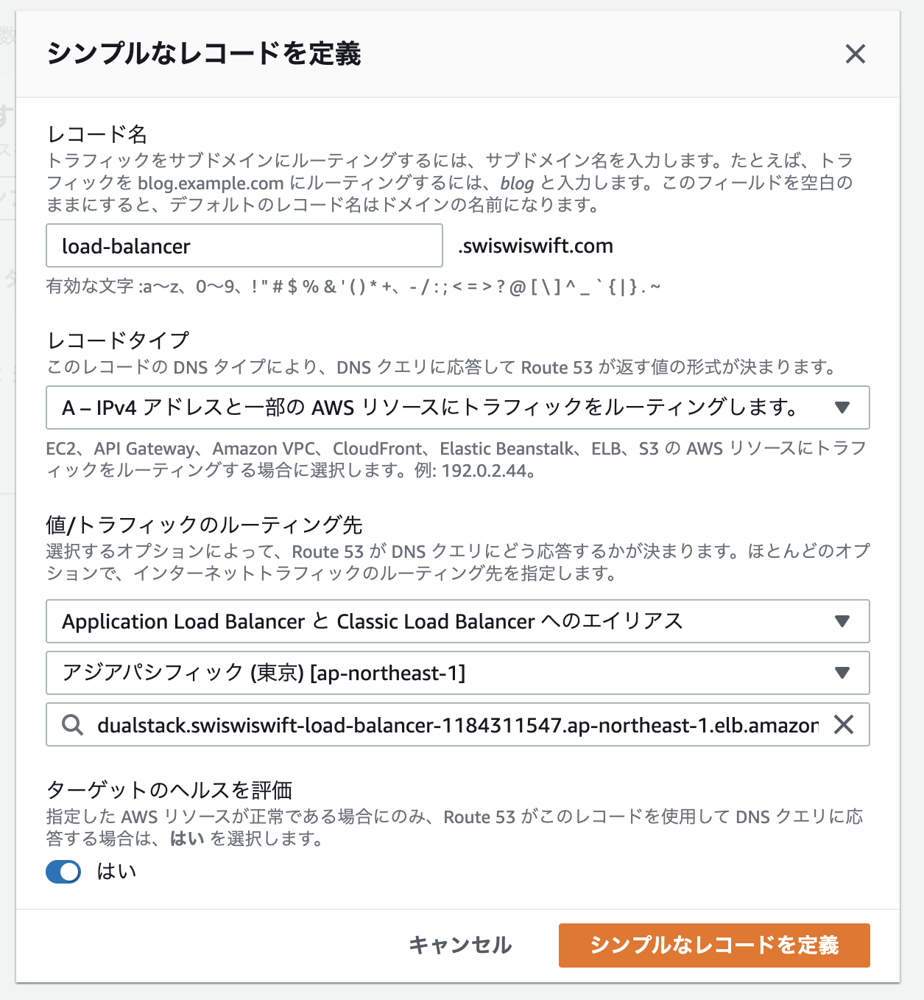
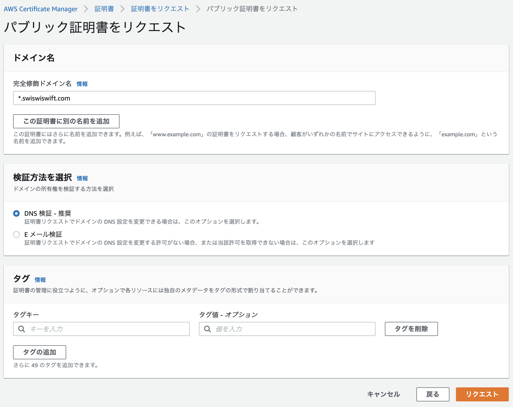
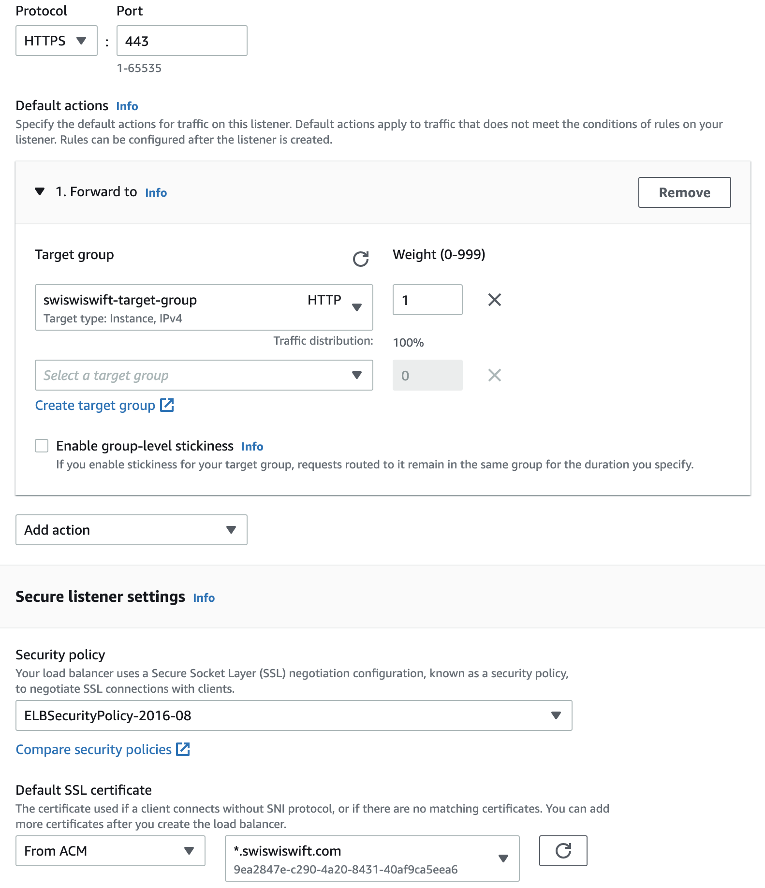

+++
title =  "ALBに独自ドメインを設定してHTTPSにする"
url = "2022-03-01"
date = "2022-03-01"
description = "ALBに独自ドメインを設定してHTTPSにする"
tags = [
  "AWS"
]
categories = [
  "AWS"
]
archives = "2022/03"
aliases = ["migrate-from-jekyl"]
+++

<br>

ALBに独自ドメインを設定してHTTPSにする方法です。
ALBの向き先をnginxをインストールしたEC2インスタンスに設定し、ACMを使ってHTTPSにします。


## EC2インスタンスの設定

まずEC2インスタンスをパブリックサブネットに作成します。
Amazon Linux2, インスタンスタイプは t2.nano で作りました。
無料枠が残っている場合は t2.micro で作ると良いかもしれません。

次にSSH用のキーペアに権限を調整し、SSHログインします。
パブリックIPアドレスはEC2インスタンスのコンソールから確認します。

```
$ chmod 400 key-pair.pem
$ ssh -i key-pair.pem ec2-user@{IP_Address}
```

nginxをインストールします。

```
$ yum search nginx
$ sudo amazon-linux-extras install nginx1
$ nginx -v
```

nginxを起動します。起動したことを確認します。

```
$ sudo systemctl start nginx
$ sudo systemctl status nginx
```

次にインターネットからEC2インスタンスにアクセスできるようにセキュリティグループで80番ポートを許可します。


ブラウザにEC2インスタンスのパブリックIPを入力してアクセスするとnginxのページが表示されることを確認します。


## ALBとターゲットグループの設定

次にALBの設定を行います。
EC2 -> ロードバランサー と進み、Application Load Balancer を選択して作成します。



ALBの作成にはターゲットグループが必要なので、Listeners and routing の項目の Create target group からターゲットグループを作成します。



ターゲットタイプにインスタンスを設定しターゲットグループを作成します。



先ほど作成したEC2インスタンスを登録します。



ALBの作成画面に戻り、先ほど作成したターゲットグループを設定し、ALBを作成します。



インターネットからHTTPでアクセスできるようにALBのセキュリティグループを設定します。


ALBのURLをブラウザに入力し、nginxのページが表示されることを確認します。


## Route53を使いALBに独自ドメインを設定する

Route53のコンソールからホストゾーンを選択し、シンプルルーテングを追加します。


任意のレコード名を設定し、ルーティング先に先ほど追加したALBを設定します。



追加したレコードにブラウザからアクセスし、nginxの画面が表示されることを確認します。


## AWS Certificate Managerを使って証明書を作成してHTTPSにする

ACMからパブリック証明書をリクエストします。




ALBのリスナールールにHTTPSのリスナールールを設定します。




最後にHTTPからのリクエストをHTTPSにリダイレクトする設定を行います。
ブラウザからHTTPSでアクセスできることを確認します。


