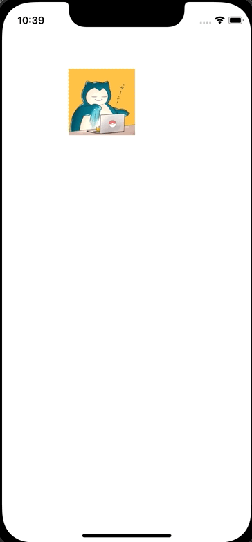

+++
title = "Swiftでタップ、ドラッグした箇所にViewを移動させる"
url = "2022-06-02"
date = "2022-06-02"
description = "Swiftでタップ、ドラッグした箇所にViewを移動させる"
tags = [
  "Swift"
]
categories = [
  "Swift"
]
archives = "2022/05"
aliases = ["migrate-from-jekyl"]
+++

 

Swiftでタップ、ドラッグした箇所にViewを移動させる方法です。
ViewController でタッチのイベントを検出し、その箇所にViewを移動させています。

<!-- Amazon Ads -->


<!-- Google Ads -->




