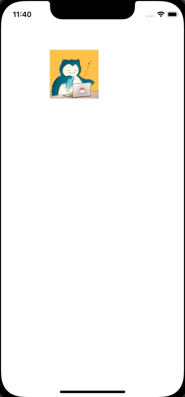

+++
title = "Swiftでドラッグで移動し、長押しでContextMenuを表示する"
url = "2022-06-03"
date = "2022-06-03"
description = "Swiftでドラッグで移動し、長押しでContextMenuを表示する"
tags = [
  "Swift"
]
categories = [
  "Swift"
]
archives = "2022/05"
aliases = ["migrate-from-jekyl"]
+++

 

Swiftでドラッグで移動し、長押しでContextMenuを表示する方法です。
ViewController でタッチのイベントを検出し、その箇所にViewを移動させています。
同時にContextMenuのinteractionも設定しています。

<!-- Amazon Ads -->


<!-- Google Ads -->




