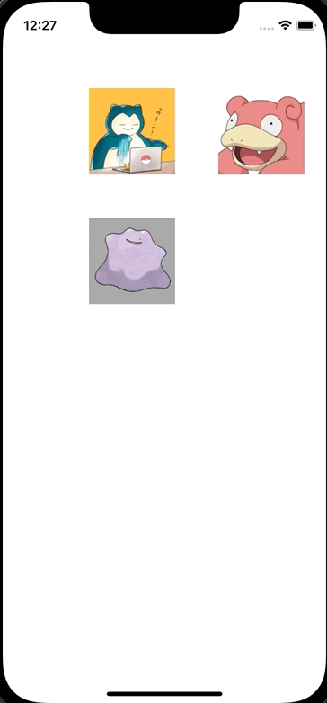

+++
title = "Swiftで複数のViewをドラッグで移動する"
url = "2022-06-04"
date = "2022-06-04"
description = "Swiftで複数のViewをドラッグで移動する"
tags = [
  "Swift"
]
categories = [
  "Swift"
]
archives = "2022/05"
aliases = ["migrate-from-jekyl"]
+++

 

Swiftで複数のViewをドラッグで移動する方法です。
ViewController でタッチのイベントを検出し、PokemonViewであればViewを移動させています。
同時にContextMenuのinteractionも設定しています。

<!-- Amazon Ads -->


<!-- Google Ads -->




