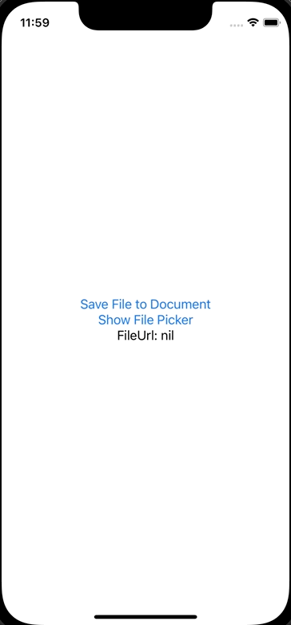
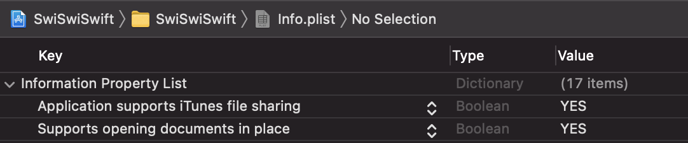

+++
title =  "iOSのファイルアプリ（UIDocumentPickerViewController）を開いてドキュメントフォルダに保存したファイルを開く"
url = "2022-06-05"
date = "2022-06-05"
description = "iOSのファイルアプリ（UIDocumentPickerViewController）を開いてドキュメントフォルダに保存したファイルを開く"
tags = [
  "SwiftUI"
]
categories = [
  "SwiftUI"
]
archives = "2021/06"
aliases = ["migrate-from-jekyl"]
+++

 

iOSのファイルアプリ（UIDocumentPickerViewController）を開いてドキュメントフォルダに保存したファイルを開く方法です。

`info.plist` にファイルアプリでドキュメントディレクトリを開けるように `Supports opening documents in place` と `Application supports iTunes file sharing` を追加し、どちらも `YES` に設定します。

<!-- Amazon Ads -->


<!-- Google Ads -->




