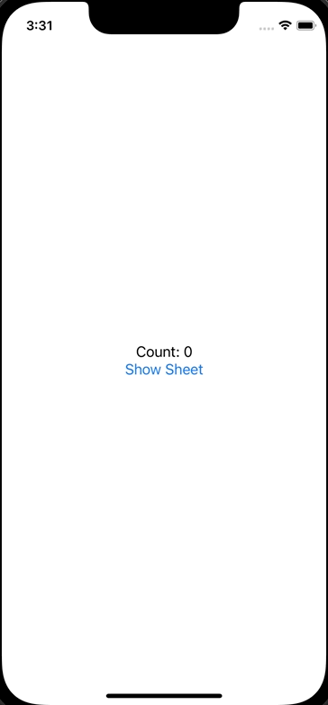

+++
title =  "SwiftUIでObservableObjectの@publishedなプロパティとBindingをする"
url = "2022-06-06"
date = "2022-06-06"
description = "SwiftUIでObservableObjectの@publishedなプロパティとBindingをする"
tags = [
  "SwiftUI"
]
categories = [
  "SwiftUI"
]
archives = "2021/06"
aliases = ["migrate-from-jekyl"]
+++

 

SwiftUIでObservableObjectの@publishedなプロパティとBindingをする方法です。
ここでは AddItemViewState まで ContentView の items をバケツリレーしています。

<!-- Amazon Ads -->


<!-- Google Ads -->



