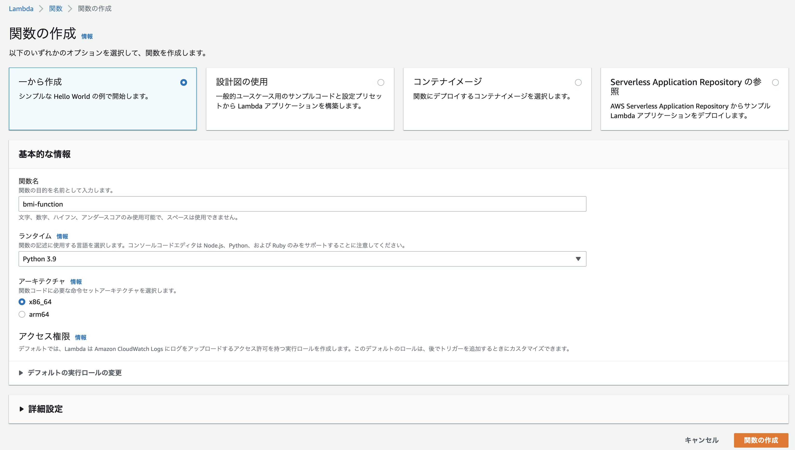
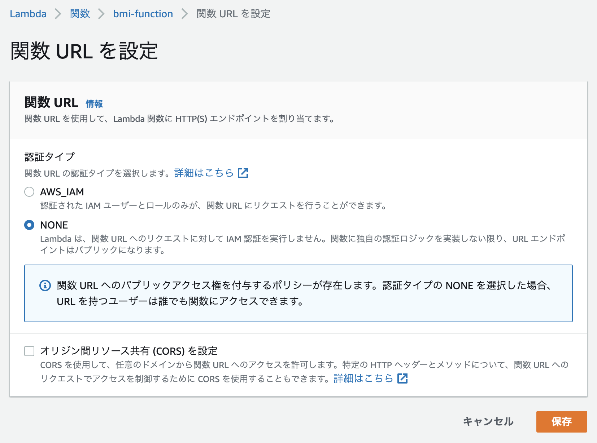

+++
title =  "LambdaでBMIを計算するAPIを作成する"
url = "2022-06-07"
date = "2022-06-07"
description = "LambdaでBMIを計算するAPIを作成する"
tags = [
  "AWS",
  "Python"
]
categories = [
  "AWS",
  "Python"
]
archives = "2021/06"
aliases = ["migrate-from-jekyl"]
+++

<br>

LambdaでBMIを計算するAPIを作成する方法です。
以下のコードをコードタブに貼り付けLambda関数を作成します。

<!-- Amazon Ads -->


<!-- Google Ads -->






次に関数URLを作成します。



curl から作成した関数URLに対してリクエストを送ります。

```
curl -X POST -H "Content-Type: application/json" -d '{"hight":170, "weight":60}' {ENDPOINT_URL}
```

以下のようなレスポンスが返れば成功です。

```
{
  "bmi": 20.761245674740486
}
```
