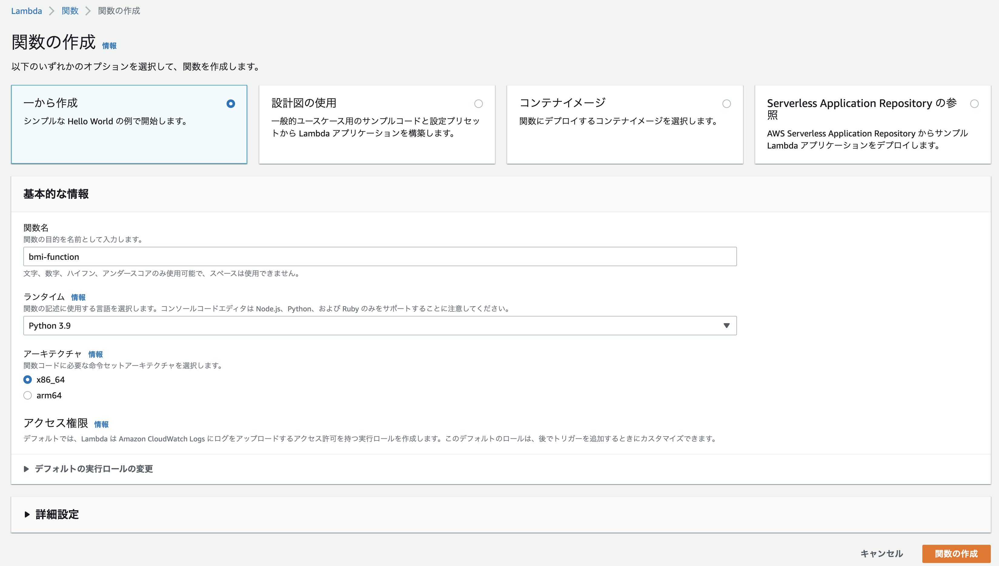
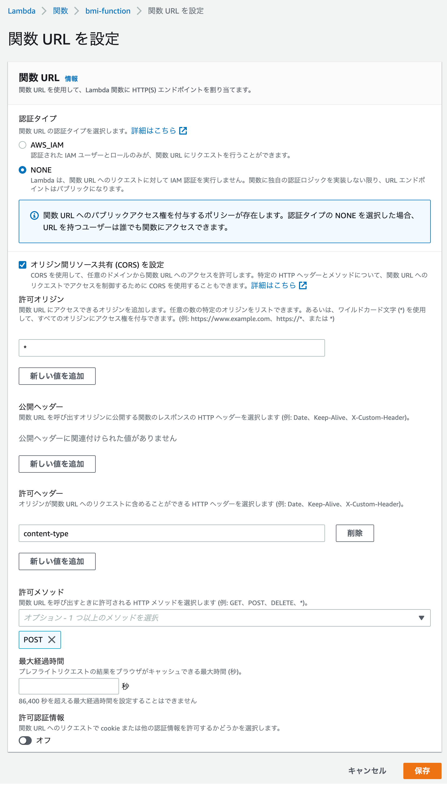

+++
title =  "LambdaでBMIを計算するAPIを作成してJSで呼び出す"
url = "2022-06-08"
date = "2022-06-08"
description = "LambdaでBMIを計算するAPIを作成してJSで呼び出す"
tags = [
  "AWS",
  "Python",
  "JavaScript"
]
categories = [
  "AWS",
  "Python",
  "JavaScript"
]
archives = "2021/06"
aliases = ["migrate-from-jekyl"]
+++

<br>

LambdaでBMIを計算するAPIを作成してJSで呼び出す方法です。


## LambdaでAPIを作成する

Lambdaと関数URLを使ってAPIを作成します。
マネジメントコンソールからLambda関数を作成します。





以下のcurlコマンドを実行し、bmiが計算されることを確認します。
`{ENDPOINT_URL}` は関数URLの値です。

```
curl -X POST -H "Content-Type: application/json" -d '{"hight":170, "weight":60}' {ENDPOINT_URL}
```

```
{
  "bmi": 20.761245674740486
}
```


## CORSの設定

オリジンが異なるJSからAPIを使うにはCORSの設定を行う必要があります。
許可ヘッダーに `content-type` を入力し、許可メソッドに `POST` を追加します。




## HTMLとJSを作成

以下のコードを参考にしながら `index.html` と `script.js` を作成します。
計算ボタンを押すとBMIが計算されるとBMIがアラートで表示されます。
JS中の `{ENDPOINT_URL}` は関数URLの値を使用します。


