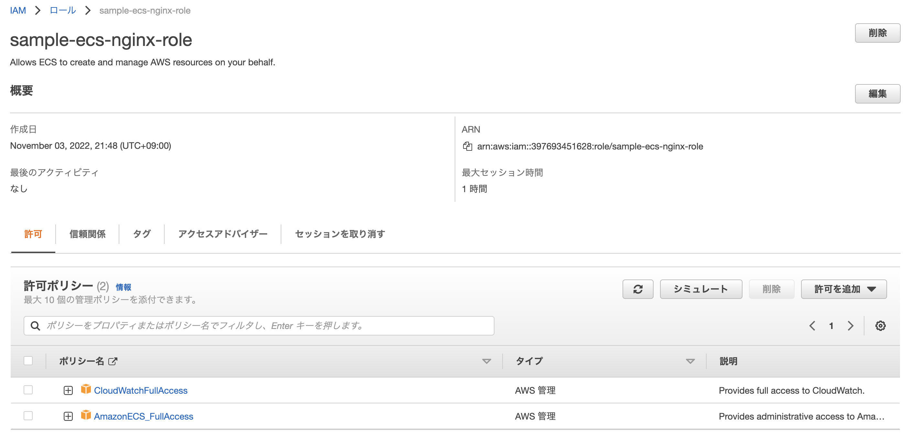

+++
title =  "ECS-EC2でnginxを動かす"
url = "2022-06-14"
date = "2022-06-14"
description = "ECS-EC2でnginxを動かす"
tags = [
  "AWS"
]
categories = [
  "AWS"
]
archives = "2022/06"
aliases = ["migrate-from-jekyl"]
+++

<br>

ECS-EC2でnginxを動かす方法です。


# ロール作成

ECSで使用するロール、`sample-ecs-nginx-role` を作成します。
`CloudWatchFullAccess` と `AmazonECS_FullAccess` のポリシーをアタッチし、信頼関係を以下のようにアタッチします。

```
{
  "Version": "2012-10-17",
  "Statement": [
    {
      "Effect": "Allow",
      "Principal": {
        "Service": [
          "ecs.amazonaws.com",
          "ecs-tasks.amazonaws.com"
        ]
      },
      "Action": "sts:AssumeRole"
    }
  ]
}
```




## ECS-EC2クラスター作成

`sample-ecs-nginx-cluster` を作成します。
インスタンスサイズ、インスタンス数、VPCなどを設定します。
パブリックIPインスタンス付きでEC2インスタンスを起動できるようにパブリックサブネットを指定します。


EC2インスタンスが作成されたことを確認します。


# EC2インスタンスにSSH接続

作成されたEC2インスタンスにSSH接続します。
アタッチされているセキュリティグループのインバウンドルールを編集し、SSH接続します。


```
$ ssh -i {KEY_PAIR_PATH} ec2-user@{PUBLIC_IP}
```

EC2インスタンスの中で `docker ps` コマンドを実行すると、EC2インスタンスのエージェントが動いていることがわかります。

```
$ docker ps
```

```
CONTAINER ID   IMAGE                            COMMAND    CREATED         STATUS                   PORTS     NAMES
a7c91bb55799   amazon/amazon-ecs-agent:latest   "/agent"   5 minutes ago   Up 5 minutes (healthy)             ecs-agent
```


# タスク定義作成

タスク定義、`sample-ecs-nginx-task-definition` を作成します。
コンテナに `nginx:latest` を指定します。


# タスク実行

作成した `sample-ecs-nginx-task-definition` を実行します。


コンテナが動いているインスタンスにアクセスすると `nginx` コンテナが動いていることを確認できます。

```
$ ssh -i {KEY_PAIR_PATH} ec2-user@{PUBLIC_IP}
```

```
CONTAINER ID   IMAGE                            COMMAND                  CREATED          STATUS                    PORTS                               NAMES
698c43bac946   nginx:latest                     "/docker-entrypoint.…"   2 minutes ago    Up 2 minutes              0.0.0.0:80->80/tcp, :::80->80/tcp   ecs-sample-ecs-nginx-task-definition-1-nginx-container-fed38598d6d0afe82900
8b4775140cc5   amazon/amazon-ecs-agent:latest   "/agent"                 14 minutes ago   Up 14 minutes (healthy)                                       ecs-agent
```

ブラウザからアクセスすると nginx のデモページが表示されます。


