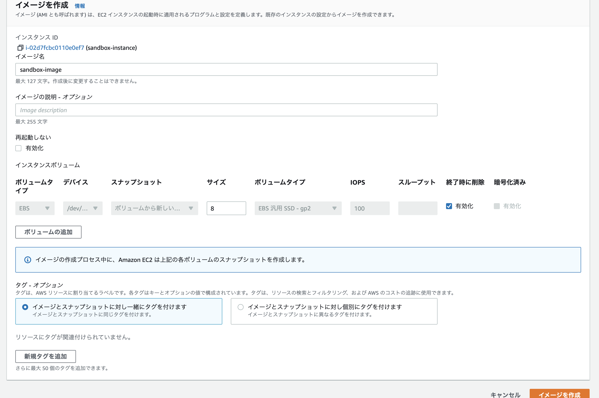
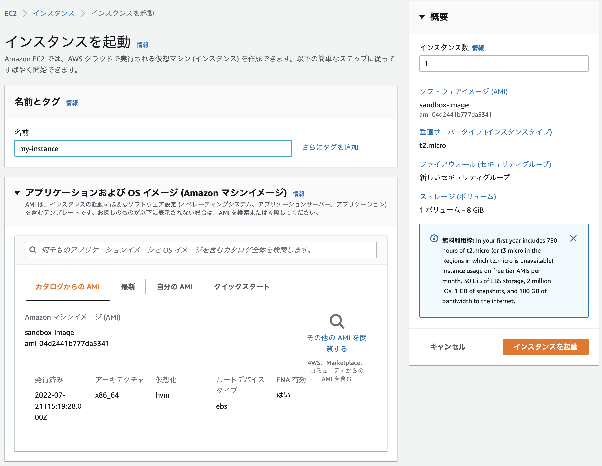

+++
title = "EC2インスタンスのバックアップを作成する（AMI）"
url = "2022-07-12"
date = "2022-07-12"
description = "EC2インスタンスのバックアップを作成する（AMI）"
tags = [
  "AWS"
]
categories = [
  "AWS"
]
archives = "2021/07"
aliases = ["migrate-from-jekyl"]
+++

<br>

EC2インスタンスのバックアップを作成する方法です。
EC2インスタンスをバックアップする方法はいくつかありますが、今回はAMI（Amazon Machine Images）を作成します。

まずはEC2インスタンスを起動させ、Nginxのインストールと自動設定を行います。[詳しくはこちら](/2022-02-09)

```
yum search nginx
sudo amazon-linux-extras install nginx1
nginx -v
sudo systemctl start nginx
sudo systemctl status nginx
sudo systemctl enable nginx
```

EC2インスタンスのIPアドレスを入力し、Nginxのデモページが表示されることを確認します。
デモページを確認したらEC2インスタンスを停止し、「アクション」->「イメージとテンプレート」->「イメージの選択」を選択します。



EC2インスタンスの起動画面から作製したAMIを選択するすることで復元することができます。
（イメージ作成から少し待たないとEC2インスタンスを起動できませんでした）



AMIの削除するにはAMIのページから「アクション」->「AMIの登録解除」から削除できます。
イメージ作製時にスナップショットも作成されるので、スナップショットも一緒に削除する必要があります。

<!-- Amazon Ads -->


<!-- Google Ads -->

