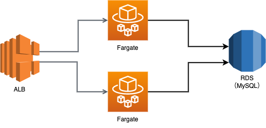
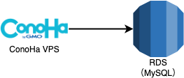
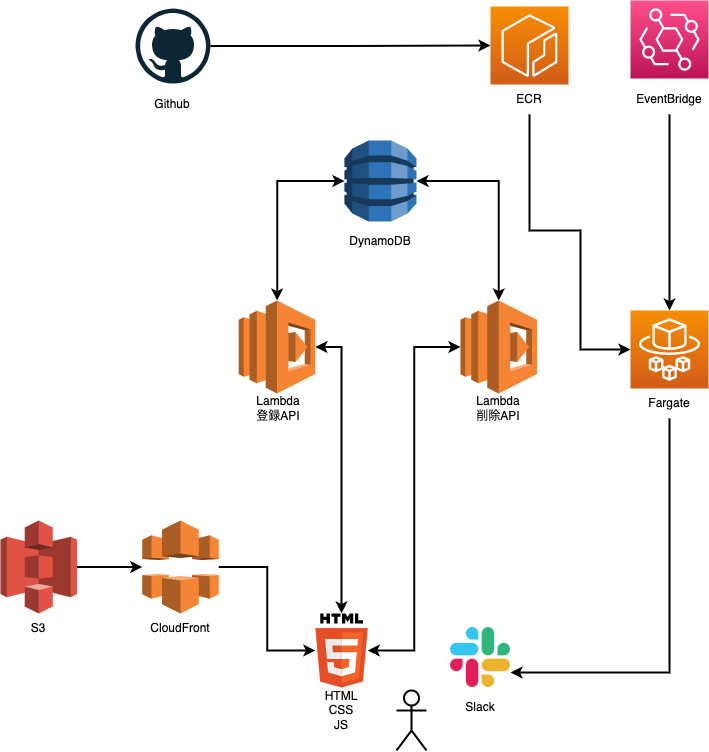
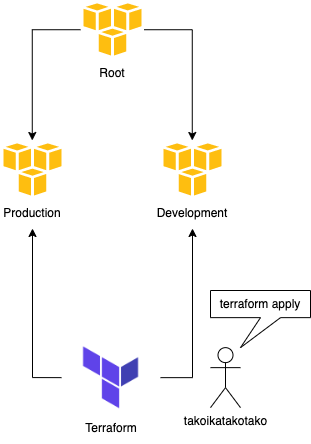

+++
title = "Terraformを使ってサーバーレスでサービスを作成したので振り返る"
url = "2022-07-13"
date = "2022-07-13"
description = "Terraformを使ってサーバーレスでサービスを作成したので振り返る"
tags = [
  "AWS"
]
categories = [
  "AWS"
]
archives = "2021/07"
aliases = ["migrate-from-jekyl"]
+++

 

# はじめに

個人開発でサービスを作るのが趣味です。
Terraform, Lambda, DynamoDBを使ってサーバーレスで簡単なービスを作成してみました。
未来の僕が現在の僕の思考を振り返られるように記事にしました。

# 今までの構成

今まではSpring Boot, MySQL, AWS, Conoha VPCなどを使ってサービスを作っていました。
このような構成です。

### ALB + Fargate + RDSを使った構成

### ConoHa VPC + RDSを使った構成

この構成では突発的な負荷に弱かったり、お金がかかりすぎてしまうことがありました。
ALB + Fargate + RDSを使った構成では5000円/月ほど、ConoHa VPC + RDSを使った構成では3000円/月ほどサービスの維持に必要です。さらに開発環境を用意しようとすると倍のお金がかかります。
この問題を解決するためにTatteform, Lambda, DynamoDBなどを使いうことで負荷に強く低コストで運営できるサーバーレスでサービス作成することにチャレンジしました。

# 今回の構成

今回作成したサービスはiOSアプリにレビューが付くとSlackに通知してくれるサービスです。(作成したと言っても全然未完成です、リポジトリは [こちら](https://github.com/takoikatakotako/app-review-notification))
このような構成です。

アプリケーション（API）は Lambdaの関数URL機能とDynamoDBを使っています。
Lambdaの言語はPythonです。
フロントは生のHTML、JSで作成し、S3とCloudFrontでホスティングしています。
アプリのレビューチェックなどの定期実行にはAmazon EventBridgeとECS Fargateを使っています。
イメージのビルドやデプロイにはGithubAction を使っています。

本番環境と開発環境の管理にはAWS OrganizationとTerraformのはWorkspace機能を使っています。

# 良かったこと

## 負荷に強くなった

LambdaとDynamoDBによるサーバーレス構成にしたことで負荷に強くなりました。
いつバズっても負荷を気にしなくても済みます。バズったことないですが。

## サーバー代が安くなった

お金のかかるRDS, Fargateなどを使うのをやめたので（ユーザーが少ない間は）サーバー代が安くなりました。500円/月程度です。
またにコード管理をすることで簡単に開発環境のリソースを消したり作り直したりすることができるようになり、開発環境でお金がかからなくなりました。

## 全てをコード管理できるようになった

全てをコード管理することで、インフラ部分のコードを使いまわせるようになりました。
簡単に開発環境のリソースを消したり作り直したりすることができるようになったのは嬉しいです。

# 悪かったこと

## テストが書きにくい、ローカルで実行できない

今までSpring Boot（JUnit）を使っていたのでテストを書くのが簡単でした。
この構成では単体テストがとにかく書きにくいです。というより書くための仕組みがありません。
ローカルで実行できないのでCIでテストを回すことができません。
何かしらローカルでテストを実行する仕組みを用意する必要を感じました。
後述のServerless Frameworkで良い感じに解決できるのかもしれません。

## DBで制約が欲しい

今までMySQLを使っていたのでDB自体に制約をつけることができました。（Not Null, 外部キー, etc）
しかしDynamoDBではDB自体に制約をつけることができないのでDBのデータを信用できません。
DBから取得したデータを常に疑いながらコードを書く必要があります。
作るサービスによってはどうしてもRDBMSを使いたくなるかもしれません。

## Lambdaを静的型付け言語で書きたい

使い捨てではないコードは静的型付け言語で書きたい派の人間です。
Pythonは好きですがどうしても型が欲しくなります。
とはいえ静的型付け言語をLambdaを使う場合はコンパイルする必要があります。
仕組みを整える必要があります。

# 検討したけど採用しなかったこと

## Serverless Frameworkについて

Lambdaを使ったサーバーレスサービスを作る場合に真っ先に選択肢に上がるのはServerless Frameworkだと思います。
しかしTerraform好き & 構成管理ツールを複数使うことに抵抗がある、学習コストが高そうなどの理由から採用しませんでした。
両方を組み合わせて使っている方がいらっしゃいましたらコメント頂きたいです。m(_ _)m

## Firebaseについて

Firebaseを使ってしまうと僕のAWS力が活かせなくなりそうなので採用しませんでした。
AWSは新しいサービスを次々とリリースしているので、それらを僕の個人開発に活かしたいです。

## PlanetScaleについて

とても興味がありました。
Lambda から PlanetScale（MySQL）を使うには Lambda Proxy を使う必要があり、そこそこ高そうなので採用しませんでした。

# さいごに

最後まで読んでくださりありがとうございました。
早く個人開発で一発当てて aurora serverless とかを気にせず使えるようになりたいです。

