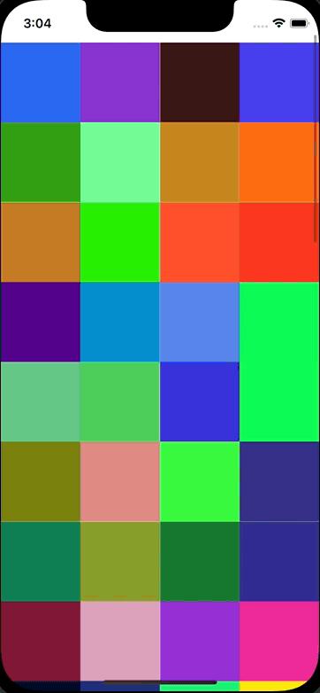

+++
title = "UICollectionViewでContextMenuを使う"
url = "2022-07-14"
date = "2022-07-14"
description = "UICollectionViewでContextMenuを使う"
tags = [
  "iOS"
]
categories = [
  "iOS"
]
archives = "2021/07"
aliases = ["migrate-from-jekyl"]
+++

 

UICollectionViewでContextMenuを使う方法です。
セルを長押しするとContextMenuを表示します。

参考: [iOS13から追加されるContext Menusについて](https://qiita.com/hirothings/items/c4e52dc2d33981c85351)

<!-- Amazon Ads -->


<!-- Google Ads -->



