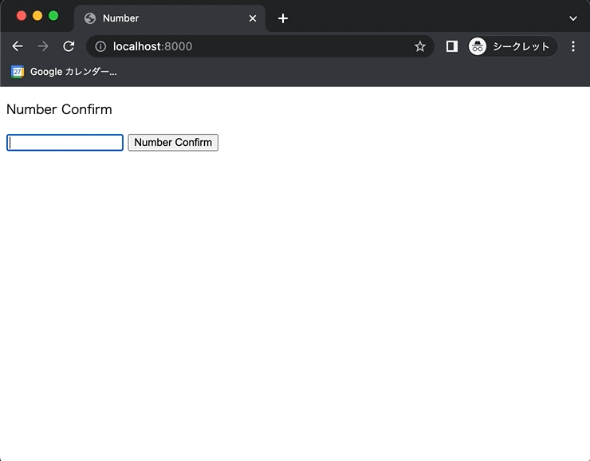

+++
title = "JavaScriptで数値か文字列か判定する"
url = "2022-07-15"
date = "2022-07-15"
description = "JavaScriptで数値か文字列か判定する"
tags = [
  "JavaScript"
]
categories = [
  "JavaScript"
]
archives = "2021/07"
aliases = ["migrate-from-jekyl"]
+++

 

JavaScriptで数値か文字列か判定する方法です。
`isNaN()` を使うと数値化文字列か判定することができます。
数値ではない場合は `true` 、数値の場合は `false` を返します。

<!-- Amazon Ads -->


<!-- Google Ads -->



