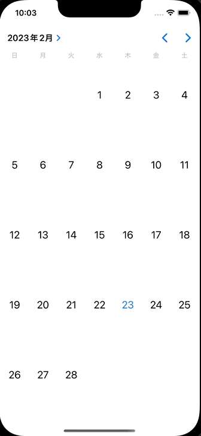

+++
title = "SwiftでUICalendarViewを使ってカレンダーを表示する"
url = "2023-02-22"
date = "2023-02-22"
description = "SwiftでUICalendarViewを使ってカレンダーを表示する"
tags = [
  "Swift"
]
categories = [
  "Swift"
]
archives = "2023/02"
aliases = ["migrate-from-jekyl"]
+++

 

SwiftでUICalendarViewを使ってカレンダーを表示する方法です。
iOS16からUICalendarViewというすごく便利なものが使えるようになりました。

参考: [How to use UICalendarView in iOS](https://nemecek.be/blog/161/how-to-use-uicalendarview-in-ios)

<!-- Google Ads -->


<!-- Amazon Ads -->




