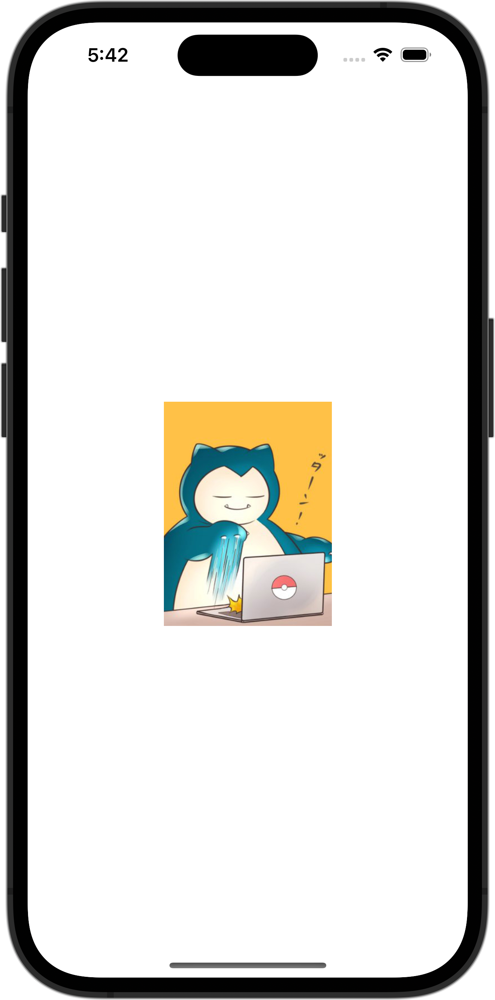

+++
title = "SwiftUIで画像を画像を丸く切り取る"
url = "2023-10-02"
date = "2023-10-02"
description = "SwiftUIで画像を画像を丸く切り取る"
tags = [
  "SwiftUI"
]
categories = [
  "SwiftUI"
]
archives = "2023/10"
aliases = ["migrate-from-jekyl"]
+++

 

SwiftUIで画像を画像を丸く切り取る方法です。
150✖︎150サイズに画像をリサイズし、丸く切り取って表示させています。
アスペクト比が異なる場合ははみ出た箇所を切り取って表示しています。


