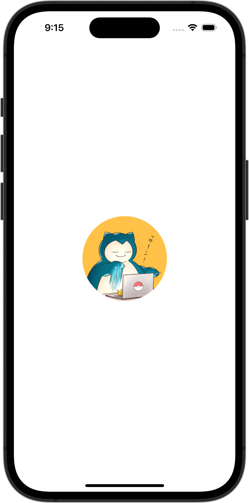

+++
title = "SwiftUIで画像をリサイズして表示する（clip）"
url = "2023-10-03"
date = "2023-10-03"
description = "SwiftUIで画像をリサイズして表示する（clip）"
tags = [
  "SwiftUI"
]
categories = [
  "SwiftUI"
]
archives = "2023/10"
aliases = ["migrate-from-jekyl"]
+++

 

SwiftUIで画像をリサイズして表示させる方法です。
150×200サイズに画像をリサイズして表示させています。
アスペクト比が異なる場合ははみ出た箇所を切り取って表示しています。


