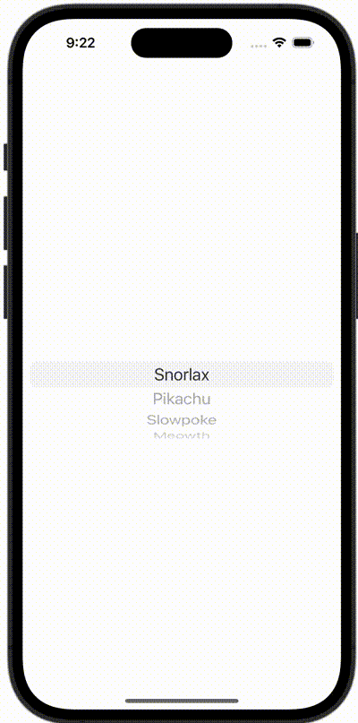

+++
title = "SwiftUIでPickerを表示する"
url = "2023-10-07"
date = "2023-10-07"
description = "SwiftUIでPickerを表示する"
tags = [
  "SwiftUI"
]
categories = [
  "SwiftUI"
]
archives = "2023/10"
aliases = ["migrate-from-jekyl"]
+++

 

SwiftUIでPickerを表示する方法です。
Pickerを使いポケモンを表示しています。


