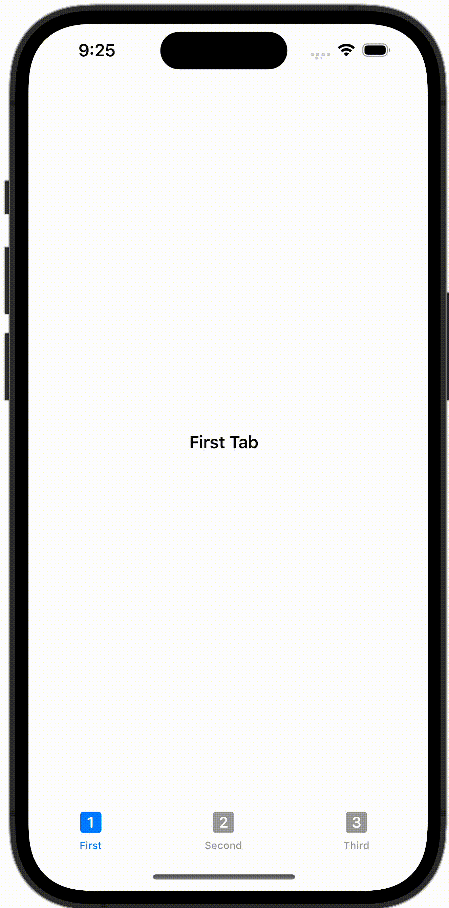

+++
title = "SwiftUIでTabViewを使って画面を切り替える"
url = "2023-10-08"
date = "2023-10-08"
description = "SwiftUIでTabViewを使って画面を切り替える"
tags = [
  "SwiftUI"
]
categories = [
  "SwiftUI"
]
archives = "2023/10"
aliases = ["migrate-from-jekyl"]
+++

 

SwiftUIでTabViewを使って画面を切り替える方法です。


