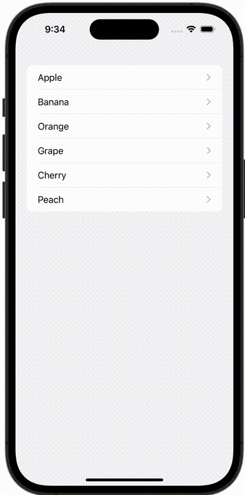

+++
title = "SwiftUIで画面遷移時に値を渡す"
url = "2023-10-11"
date = "2023-10-11"
description = "SwiftUIで画面遷移時に値を渡す"
tags = [
  "SwiftUI"
]
categories = [
  "SwiftUI"
]
archives = "2023/10"
aliases = ["migrate-from-jekyl"]
+++

 

SwiftUIで画面遷移時に値を渡す方法です。
遷移先の画面に文字列を渡しています。


