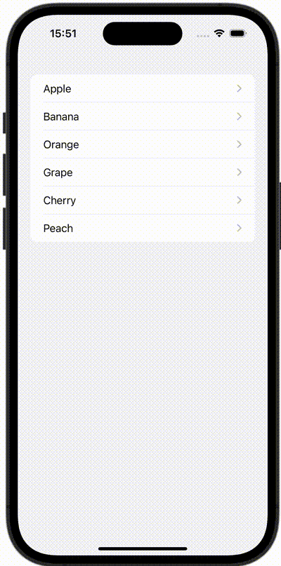

+++
title = "SwiftUIでNavigationViewの戻るボタンを非表示にする"
url = "2023-10-12"
date = "2023-10-12"
description = "SwiftUIでNavigationViewの戻るボタンを非表示にする"
tags = [
  "SwiftUI"
]
categories = [
  "SwiftUI"
]
archives = "2023/10"
aliases = ["migrate-from-jekyl"]
+++

 

SwiftUIでNavigationViewの戻るボタンを非表示にする方法です。
`navigationBarBackButtonHidden` を false にすることで非表示にすることができます。


