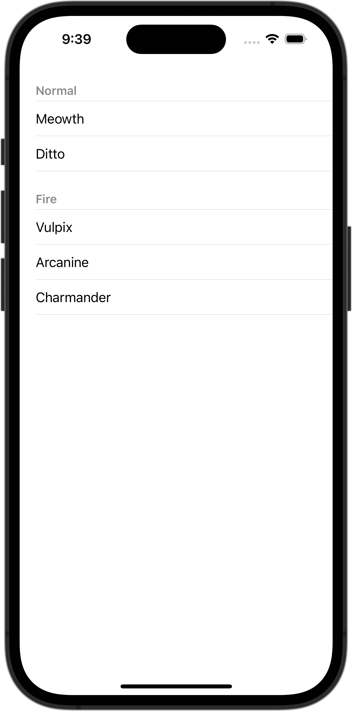

+++
title = "SwiftUIでListのスタイルを変更する(plain)"
url = "2023-10-13"
date = "2023-10-13"
description = "SwiftUIでListのスタイルを変更する(plain)"
tags = [
  "SwiftUI"
]
categories = [
  "SwiftUI"
]
archives = "2023/10"
aliases = ["migrate-from-jekyl"]
+++

 

SwiftUIでListのスタイルを変更する方法です。
`listStyle` に `plain` を設定しています。


