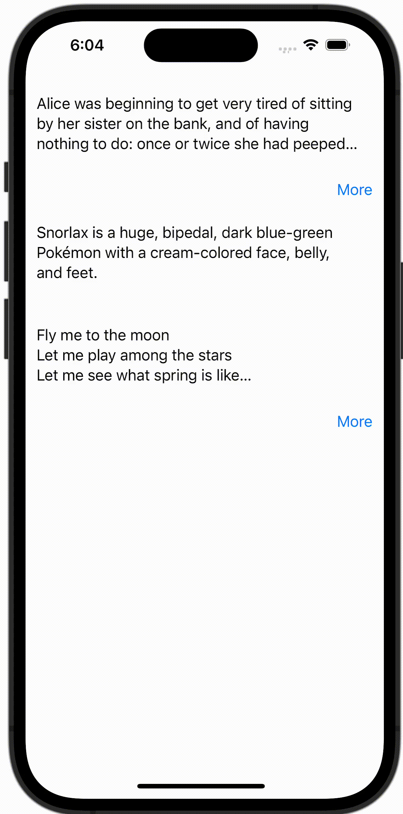

+++
title = "SwiftUIで続きを読む。。。ボタンがあるViewを実装する"
url = "2023-10-19"
date = "2023-10-19"
description = "SwiftUIで続きを読む。。。ボタンがあるViewを実装する"
tags = [
  "SwiftUI"
]
categories = [
  "SwiftUI"
]
archives = "2023/10"
aliases = ["migrate-from-jekyl"]
+++

 

SwiftUIで続きを読む。。。ボタンがあるViewを実装する方法です。


