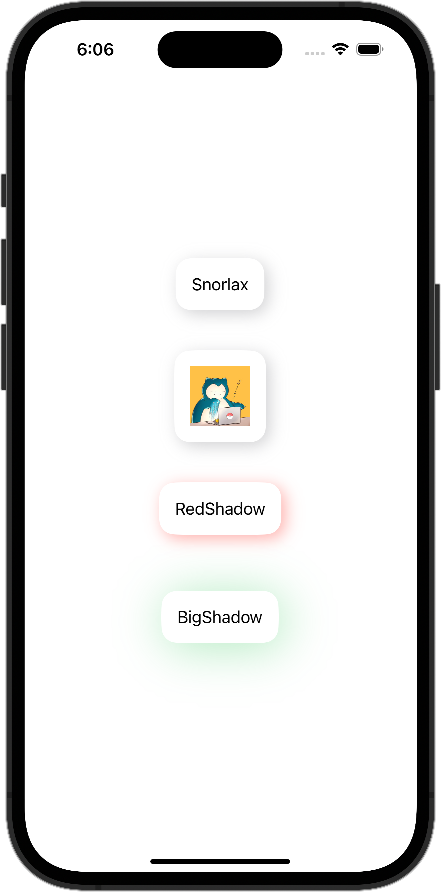

+++
title = "SwiftUIでFunctionBuilderを使ってViewに影をつける"
url = "2023-10-21"
date = "2023-10-21"
description = "SwiftUIでFunctionBuilderを使ってViewに影をつける"
tags = [
  "SwiftUI"
]
categories = [
  "SwiftUI"
]
archives = "2023/10"
aliases = ["migrate-from-jekyl"]
+++

 

SwiftUIでFunctionBuilderを使ってViewに影をつける方法です。
FunctionBuilderを使ってViewに影をつけています。


