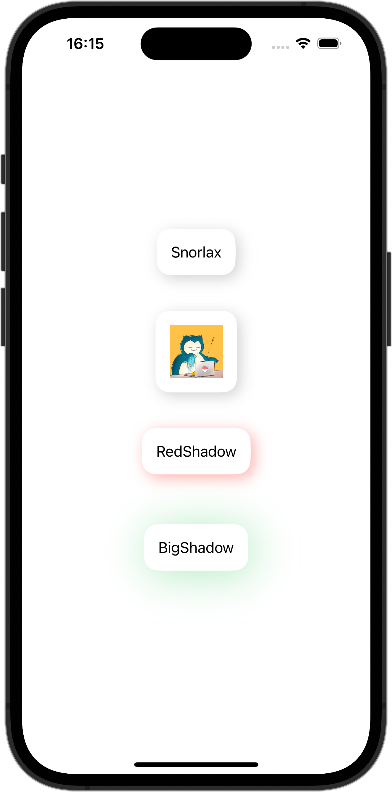

+++
title = "SwiftUIでViewModifierを使ってViewに影をつける"
url = "2023-10-22"
date = "2023-10-22"
description = "SwiftUIでViewModifierを使ってViewに影をつける"
tags = [
  "SwiftUI"
]
categories = [
  "SwiftUI"
]
archives = "2023/10"
aliases = ["migrate-from-jekyl"]
+++

 

SwiftUIでViewModifierを使ってViewに影をつける方法です。
ViewModifierを使ってViewに影をつけています。


