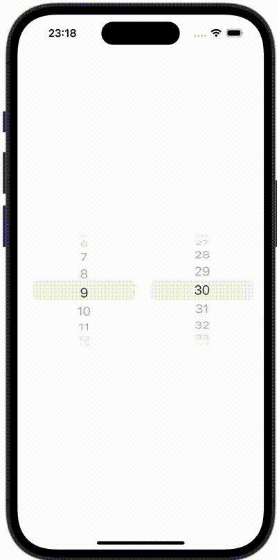

+++
title = "SwiftUIで複数行のPickerを作成する"
url = "2023-10-27"
date = "2023-10-27"
description = "SwiftUIで複数行のPickerを作成する"
tags = [
  "SwiftUI"
]
categories = [
  "SwiftUI"
]
archives = "2023/10"
aliases = ["migrate-from-jekyl"]
+++

 

SwiftUIで複数行のPickerを作成する方法です。


