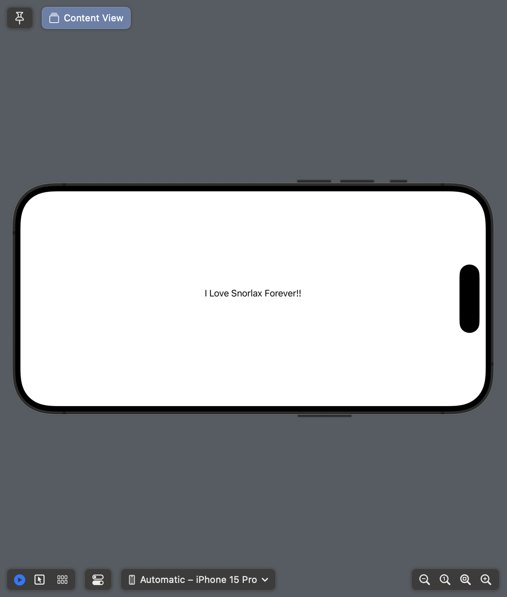

+++
title = "SwiftUIでPreviewを横向きにする"
url = "2023-10-31"
date = "2023-10-31"
description = "SwiftUIでPreviewを横向きにする"
tags = [
  "SwiftUI"
]
categories = [
  "SwiftUI"
]
archives = "2023/10"
aliases = ["migrate-from-jekyl"]
+++

 

SwiftUIでPreviewを横向きにする方法です。


