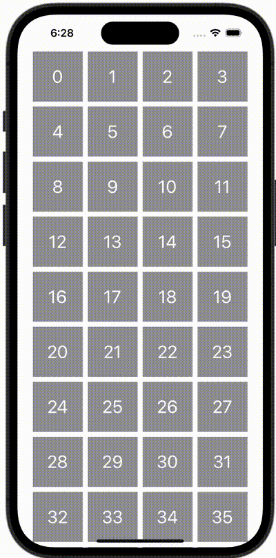

+++
title = "UICollectionViewのようにViewを並べる"
url = "2023-11-02"
date = "2023-11-02"
description = "UICollectionViewのようにViewを並べる"
tags = [
  "SwiftUI"
]
categories = [
  "SwiftUI"
]
archives = "2023/11"
aliases = ["migrate-from-jekyl"]
+++

 

UICollectionViewのようにViewを並べる方法です。


