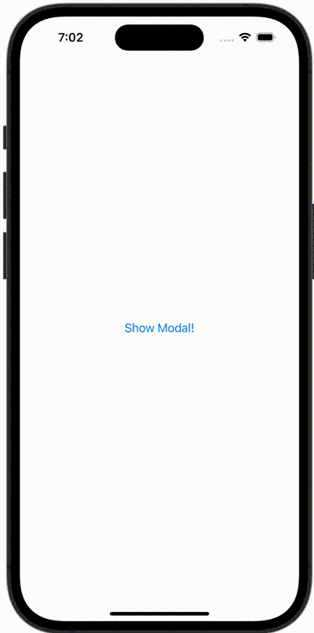

+++
title = "SwiftUIで閉じることができないモーダルを表示する"
url = "2023-11-04"
date = "2023-11-04"
description = "SwiftUIで閉じることができないモーダルを表示する"
tags = [
  "SwiftUI"
]
categories = [
  "SwiftUI"
]
archives = "2023/11"
aliases = ["migrate-from-jekyl"]
+++

 

SwiftUIで閉じることができないモーダルを表示する方法です。


