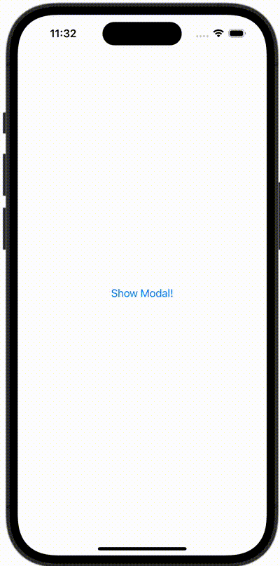

+++
title = "SwiftUIでハーフモーダルを表示する"
url = "2023-11-06"
date = "2023-11-06"
description = "SwiftUIでハーフモーダルを表示する"
tags = [
  "SwiftUI"
]
categories = [
  "SwiftUI"
]
archives = "2023/11"
aliases = ["migrate-from-jekyl"]
+++

 

SwiftUIでハーフモーダルを表示する方法です。


