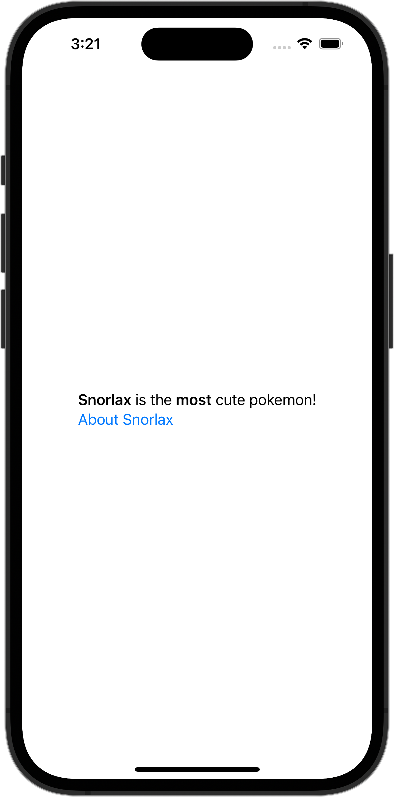

+++
title = "マークダウンを表示する"
url = "2023-11-07"
date = "2023-11-07"
description = "マークダウンを表示する"
tags = [
  "SwiftUI"
]
categories = [
  "SwiftUI"
]
archives = "2023/10"
aliases = ["migrate-from-jekyl"]
+++

 

マークダウンを表示する方法です。


